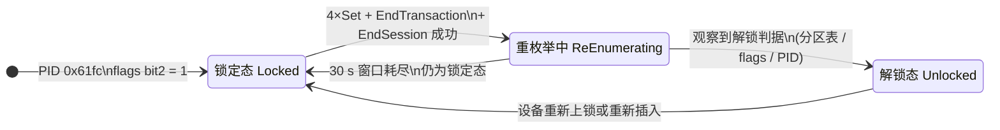
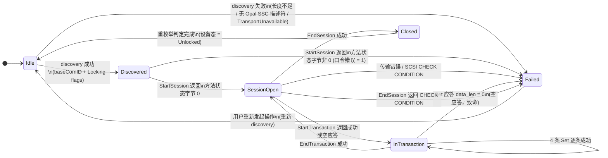

# MagiShield — T7 Shield GUI 客户端权威规格（Spec）

**状态:** Authoritative（唯一权威）
**版本:** 0.1（决策基线：D01–D30）
**受众:** 开发（§3–§7 是实现与评审依据）、测试（§7–§8 与 §10 锚点是验收依据）、运维与客服（§5 错误模型是排障依据）、评审（§1、§9 是范围与归因依据）
**范围:** 定义面向 Samsung PSSD T7 Shield（USB `04e8:61fc` / `04e8:61fb`）的 Rust + GTK4 + libadwaita GUI 客户端（运行目标平台为仅 Linux）的目标行为：设备枚举与锁定状态识别、TCG Opal「A 路」解锁与口令校验的字节级契约、传输层抽象与 Linux 传输行为、错误模型、状态机、UI 与口令安全纪律；不定义 B/C 路协议、固件与安全擦除能力。
**治理:** 行为变更必须先在 §9 决策日志新增或归因决策 ID，同步 `tools/audit_manifest.json`，运行 `python tools/test_audit_spec.py`、`python tools/audit_spec.py`、`python tools/barriers.py` 全部 PASS 后，再进入 plan/代码；被取代条款原地合并或删除，不留历史修订标注；spec 与代码同批提交。
**变更历史:** 见 `history/`、`issues/` 与 §9 决策日志。本 spec 目录名仍为 `docs/specs/t7-magician/`：目录改名牵连 `history/` 冻结快照治理，待用户确认后另开变更；正文一律使用 magi 体系名（`magi` / `magi-*` / `MagiShield`）。跨仓库证据源：t7Shield-protocol 仓库 `analysis/protocol-notes.md`（§0/§3/§4/§10/§12）、`analysis/unlock-report.md`、`analysis/probe-usb.md`、`tools/unlock/unlock.py`、`tools/t7ctl/README.md`。

---

## 1. 背景与目标

### 1.1 为什么写

- T7 Shield 是硬件加密移动固态盘：口令在盘内校验、数据由盘内控制器加解密，锁定态只向主机暴露 34.5 MB 影子 FAT16 安全区（证据：`analysis/probe-usb.md` §2）。
- 官方客户端只提供 Windows / macOS 两个版本；Linux 上无官方客户端可用。
- 标准 Opal 工具链在本设备上不可用，三臂对照实测结论（证据：t7Shield-protocol `analysis/toolcmp-report.md` 与 `README.md`）：
  - 臂 A（`sedutil-cli` 1.15.1）：`--scan` 判为 `No`，`--query` 报 `Invalid or unsupported disk`，全部写尝试失败；
  - 臂 B（Linux 内核 sed-opal）：本环境客户机内核未编译 `CONFIG_BLK_SED_OPAL`，不可执行；
  - 臂 C（自研 `tools/unlock/unlock.py`）：端到端解锁成功，宿主出现真实 GPT 并自动挂载数据卷。
- 不可用的直接原因有两条，均已在协议层定论：本设备把**用户口令原文字节**当作 StartSession 的 HostChallenge（无 SHA-256/PBKDF2 派生，证据：protocol-notes §12.2），且在 4 条 `Set` 中包含三星私有的 `Set(DataStore, 行 2 ← 0x03)`。
- 现状缺口：已有协议结论与参考实现，但**没有**面向用户的客户端；解锁能力停留在 Python + VirtualBox 直通脚本形态，普通用户无法使用。

### 1.2 目标

- GOAL-1 客户端运行于仅 Linux 的目标平台，并识别设备型号与锁定状态。
- GOAL-2 Linux 上完成端到端解锁：Discovery → StartSession → StartTransaction → 4×`Set` → EndTransaction → EndSession，成功判据按 §4 排序裁决。
- GOAL-3 Linux 上完成口令校验（ValidatePassword），错误口令由设备侧的 TCG 方法状态字节判定，不依赖 SCSI 状态。
- GOAL-4 以 GTK4 + libadwaita 呈现设备卡片、锁定状态、操作入口与进度/结果反馈；协议操作不阻塞 UI 主线程。
- GOAL-5 口令全程不落盘、不进诊断记录、不进剪贴板；传输通道不可用时给出明确错误而不是沉默或反复重试。

### 1.3 非目标（Out of Scope）

- **固件更新**：不作任何固件读写，也不暴露入口。
- **安全擦除与恢复出厂**：`FactoryReset` 在官方协议层是桩函数 `mov w0,#2; ret`（libSILU07 @0x57a14），`GetRandomKey` 同为桩（@0x57a0c）；本客户端不提供该类操作。
- **三星私有通道 0xFD**：本设备协议表为 `{0x00, 0x01, 0x02}`，对 `0xFD` 的全部 SPSP 实测回 sense `03/11/00`；B 路（RSA-2048/OAEP-SHA256）与 C 路（ATA/SAT 双 SHA-256 + SMART log 0xD7 盐）不进入实现。
- **Windows 平台**；**A 路以外的协议路径**。
- **macOS 平台**：运行目标平台为仅 Linux（D27）；含 kext/dext/VM 中继的一切 macOS 通路均不进入实现范围。
- **性能基准测试**：只写 §6 的量化上界，不产出跑分与对比报告。
- **文件系统与挂载**：真实分区表出现后的挂载由操作系统完成，客户端只观察与呈现。
- **口令写操作（设置 / 修改 / 删除）的字节级实现**：当前证据不足以写出可执行序列，按 §4 只定义到明确错误与证据缺口登记（见 `issues/`）。

## 2. 术语表

| 术语 | 定义 | 禁止同义词 |
|---|---|---|
| A 路 | 官方 `libSILU07` 的 `SIL_UsbNVMeWithTCG` 实现：SCSI SECURITY PROTOCOL `0x01` 隧道承载 TCG Opal 2.00 方法调用 | 标准路、TCG 路 |
| 锁定态 | 设备以 USB PID `0x61fc` 枚举、只暴露影子安全区的状态 | 加密态、锁住 |
| 解锁态 | 设备以 USB PID `0x61fb` 枚举、暴露真实分区表的状态 | 打开态、明文态 |
| 重枚举 | 解锁生效后设备自行以新 PID 重新枚举 USB 的过程；主机不发送任何触发命令 | 重连、热插拔 |
| ComID | SCSI SECURITY PROTOCOL 的 SP specific 字段值；本规格要求从 Level-0 Discovery 的 Opal SSC 描述符运行时解析 | SP specific 号、会话 ID |
| baseComID | Level-0 Discovery 中 Opal SSC V2.00 描述符 `+4` 处的 BE16 值，即运行时解析所得的 ComID | 固定 ComID |
| Level-0 Discovery | 用固定 SP specific `0x0001` 读取的特性发现响应（4096 B 缓冲），描述符区从偏移 `0x30` 开始 | 特性表、discovery 页 |
| Locking flags | Level-0 Discovery 中 Locking 特性描述符 `+4` 的 flags 字节；位语义 bit2 = Locked、bit4 = MBREnabled、bit5 = MBRDone | 状态位、标志字节 |
| TSN | 报文头 `+0x14` 的 BE32：设备（Target）会话号 | 会话号一、SessionId |
| HSN | 报文头 `+0x18` 的 BE32：主机会话号（本设备为 `1`） | 会话号二、HostSession |
| 会话 | StartSession 成功到 EndSession 之间的状态；会话内命令必须携带正确的 TSN/HSN | 连接、链路 |
| 事务 | StartTransaction 到 EndTransaction 之间的一组 `Set`；成功后由 EndTransaction 提交 | 批次、事务组 |
| 令牌流 | 报文 `+0x38` 起的 TCG 编码字节序列（方法调用与原子） | 命令体、payload 内容 |
| 原子 | 令牌流中的基本编码单元：token、tiny uint、短/中/长字节串、UID | 元素、atom 项 |
| ComPacket / Packet / SubPacket | 报文头三层的名称，总长 `0x38`：`+0x00`、`+0x14`、`+0x2c` 分别是三层起点 | 包头三层 |
| 状态列表 | 方法调用末尾的 `F0 00 00 00 F1` 占位序列，用于承载方法状态 | 返回列表 |
| 方法状态字节 | 状态列表内被设备写入的结果字节：`0` = 成功，非 `0` = 失败（口令错误时为 `1`） | 返回码、error code |
| 空应答 | `data_len = 0` 且无状态列表的响应报文（仅 `+0x04` 回显 ComID） | 空包、零长应答 |
| 宿主（host） | 运行本客户端的操作系统 | 主机系统 |
| 工作线程 | 执行协议操作的非 UI 线程；每设备同时最多一个 | 后台线程池、异步任务 |
| 单飞 | 同一设备同一时刻只允许一个协议操作在执行的状态约束 | 互斥、锁 |
| 口令缓冲 | 保存用户口令明文的进程内缓冲，生命周期受 §4 约束 | 密码变量、pwd 串 |
| 影子安全区 | 锁定态暴露的 34.5 MB FAT16 区域（S AREA 人格） | 安全区、隐藏区 |
| 设备节点 | Linux 上用于下发 SCSI 命令的字符设备（`/dev/sg*`） | 盘符、块设备路径 |
| 描述符侦察 | 只读取 USB 设备/配置/接口/端点描述符、不打开接口、不发送 CDB 的枚举动作 | 设备探测、扫描 |
| 黄金向量 | 由官方实现逐字节还原、在测试中固定比对的期望字节串 | 参考样例、fixture 值 |
| 呈现码 | UI 与诊断输出使用的稳定错误标识字符串，与 `AppError` 变体一一对应 | 错误标题、UI 错误名 |
| `token[i]` | 响应令牌流中按 §4.9 遍历顺序编号（从 0 起）的第 i 个原子 | 第 i 个元素 |
| `StatusListForm` | 状态列表形态的选择类型：`Single` = 5 字节单列表，`Two` = 10 字节双列表；选择规则见 §4.6 | 状态列表变体、列表模式 |
| `UnlockStep` | 进度步骤类型，与 §4.6 的 7 条命令一一对应 | 进度项、步骤枚举 |
| `TransportError::Platform` | 承载非 SCSI 语义平台错误码（如既非 GOOD 也非 CHECK CONDITION 的完成状态）的传输层变体；SCSI 语义错误走 `ScsiCheckCondition` | 平台异常、未知传输错误 |
| 诊断记录 | 内存环形缓冲中的结构化记录（上限 512 条）；只允许 CDB 字节、传输方向、响应长度三类字段，禁止请求载荷、令牌流与口令 | 请求日志、trace、dump |

## 3. 系统模型与状态机

### 3.1 架构与边界

```mermaid
graph LR
    subgraph app["crates/magi-app（GTK4 + libadwaita）"]
        UI["应用外壳：侧边栏导航（概览/关于）<br/>Rust 代码构建 libadwaita 界面（D29/D30）"]
        CTL["操作控制器<br/>单飞 + 工作线程 + channel 回主线程"]
        I18N["i18n 资源<br/>zh-CN（默认）/ en"]
    end
    subgraph proto["crates/magi-protocol（纯协议，无 UI 依赖）"]
        DISC["Level-0 Discovery 解析<br/>baseComID + Locking flags"]
        FRAME["帧构造与响应解析<br/>0x38 头 + 令牌流 + 方法状态字节"]
        SM["会话状态机<br/>Idle→Discovered→SessionOpen→InTransaction→Closed/Failed"]
    end
    subgraph tr["crates/magi-transport（Transport trait）"]
        TRT["Transport trait"]
        LIN["LinuxSgIo：sg_io 下发 12 字节 CDB"]
    end
    DEV["T7 Shield 设备<br/>04e8:61fc / 04e8:61fb"]
    UI --> CTL
    CTL --> SM
    SM --> DISC
    SM --> FRAME
    DISC --> FRAME
    DISC --> TRT
    FRAME --> TRT
    TRT --> LIN
    LIN -->|"SECURITY PROTOCOL IN / OUT"| DEV
    I18N --- UI
```



依赖方向为单向：`magi-app` → `magi-protocol` → `magi-transport`。`magi-protocol` 不得依赖 GTK 与任何 UI 类型；`magi-app` 不得直接构造 CDB 或令牌流。§3.1 不负责：设备侧固件的内部状态命名、操作系统内核驱动行为、文件系统层。

### 3.2 状态定义

```rust
/// 设备态：由 USB 描述符扫描结果与 Level-0 Discovery 的 Locking flags 共同裁决。
pub enum DeviceState {
    /// 锁定态：PID 0x61fc，Locking flags bit2 = 1。
    Locked,
    /// 解锁态：PID 0x61fb，Locking flags bit2 = 0 且 bit5 = 1。
    Unlocked,
    /// 重枚举窗口内：解锁序列已收尾，PID 尚未稳定为新值或设备节点暂时不存在。
    ReEnumerating,
}

/// 客户端会话态：一次操作从 Idle 走到 Closed 或 Failed，每次操作独立发起。
pub enum SessionState {
    Idle,
    Discovered,
    SessionOpen,
    InTransaction,
    Closed,
    Failed,
}

/// 一次操作的上下文；`base_comid` 只能来自 Discovery 解析结果。
pub struct OperationContext {
    pub device_state: DeviceState,
    pub session_state: SessionState,
    pub base_comid: Option<u16>,
    /// 报文头 +0x14：设备会话号（StartSession 响应 token[5] 的 4 字节映像）。
    pub tsn: [u8; 4],
    /// 报文头 +0x18：主机会话号（StartSession 响应 token[4] 的 4 字节映像）。
    pub hsn: [u8; 4],
}

/// Locking flags 原始字节；`raw` 为 0 表示尚未取得 Discovery 结果。
pub struct LockingFlags { pub raw: u8 }
```

零值规则：`base_comid` 为 `None` 时禁止发送任何需要 ComID 的命令（只有 discovery 可用，其 SP specific 固定为 `0x0001`）；`tsn`/`hsn` 为零值时禁止发送 `StartTransaction` 及其后的任何命令；`LockingFlags.raw == 0` 表示未取得 flags（未做 discovery，或响应缺少 Locking 描述符），禁止当作「未锁定」判据；缺少 Opal SSC 描述符回报 `NoOpalSscDescriptor`，缺少 Locking 描述符回报 `LockingDescriptorMissing`。

### 3.3 状态转换

设备态（判定依据：USB PID 与 Level-0 Discovery 的 Locking flags）：



| 设备态 | 进入条件 | 退出条件 | 可观察结果 | 失败分支 |
|---|---|---|---|---|
| 锁定态 | PID `0x61fc` 且 Locking flags bit2 = 1 | 解锁序列提交成功 → 重枚举中 | 宿主只出现 34.5 MB 影子 FAT16 卷 | discovery 失败或设备不可打开：停留在本态并返回 §5 错误，不发送任何写类命令 |
| 重枚举中 | 解锁序列收尾后（EndSession 成功） | 观察到任一解锁判据 → 解锁态；或 30 s 观察窗口耗尽 → 回到锁定态 | 设备节点短暂消失、PID 过渡、分区表逐步出现 | 窗口耗尽仍未观察到解锁态：呈现「未观察到重枚举」并复核判据，不重发命令 |
| 解锁态 | PID `0x61fb` 且 Locking flags bit2 = 0（bit5 = 1） | 设备被重新上锁或重新插入 | 宿主出现真实分区表并可挂载 | 分区表未出现但 PID 已变化：只呈现 PID 变化判据，不声称解锁成功 |

客户端会话态：



| 状态 | 进入条件 | 退出条件 | 可观察结果 | 失败分支 |
|---|---|---|---|---|
| Idle | 应用启动、设备重新插入、上一次操作返回 Closed/Failed | 发起 discovery 并成功 → Discovered；失败 → Failed | 设备卡片显示枚举结果，操作入口按设备态启用 | discovery 失败：呈现 §5 对应错误，保持 Idle 可重试 |
| Discovered | Level-0 Discovery 解析成功，`base_comid` 与 Locking flags 就绪 | StartSession 成功 → SessionOpen；被拒 → Failed | 显示锁定状态（Locking flags）与可执行操作 | StartSession 方法状态字节非 0：呈现「口令被拒」，不得改写设备状态 |
| SessionOpen | StartSession 方法状态字节为 0，`tsn`/`hsn` 已写入上下文 | StartTransaction → InTransaction；EndSession → Closed | 显示「会话已建立，事务未开始」 | EndSession 返回 CHECK CONDITION：呈现错误并进入 Failed |
| InTransaction | StartTransaction 已发送（含空应答） | EndTransaction 成功 → SessionOpen | 逐条显示 4 条 `Set` 的执行进度 | 任一 `Set` 应答 `data_len = 0`：判致命，终止序列并尽力 EndSession |
| Closed | EndSession 成功 | 重枚举判定完成 → Idle | 显示最终判据结果（§4 的顺序） | 重枚举窗口内未观察到解锁态：呈现「未观察到重枚举」，保留诊断信息 |
| Failed | 任一环节返回不可恢复错误 | 用户重新发起操作 → Idle | 显示错误分类与建议动作 | 清理动作（尽力 EndSession、zeroize 口令缓冲）本身失败时只记录，不改变错误分类 |

设备态与客户端会话态正交：设备态由 PID 与 Locking flags 裁决，客户端会话态由命令结果裁决；`SessionState::Closed` 之后必须重新读取设备态以裁决最终结果。

## 4. 功能需求与接口契约

### 4.1 REQ-001 设备枚举与识别

> **作为** 用户，**我希望** 客户端在设备接入后自动识别型号与锁定状态，**以便** 只在识别成立的设备上发起操作。
> **优先级:** P0
> **归因:** D01
> **验收标准:**
> - Given 设备已接入且 `idVendor = 0x04e8`；When 客户端扫描 USB；Then 按 `idProduct` 判定设备态：`0x61fc` → 锁定态，`0x61fb` → 解锁态。
> - Given `idVendor = 0x04e8` 但 `idProduct` 不属于上表；When 扫描；Then 不识别为 T7 Shield，不发送任何 SCSI 命令。

契约：

```rust
pub const VENDOR_ID: u16 = 0x04e8;
pub const PID_LOCKED: u16 = 0x61fc;     // 锁定态人格名 "Portable SSD T7 Shield S AREA"
pub const PID_UNLOCKED: u16 = 0x61fb;   // 解锁态人格名 "Portable SSD T7 Shield MBR"

pub fn identify_device(vid: u16, pid: u16) -> Option<DeviceState>;
```

正常示例：`identify_device(0x04e8, 0x61fc)` → `Some(DeviceState::Locked)`。
异常示例：`identify_device(0x04e8, 0x61ff)` → `None`，UI 呈现「未发现 T7 Shield」，操作入口保持禁用。

### 4.2 REQ-002 Level-0 Discovery 与 ComID 运行时解析

> **作为** 用户，**我希望** 客户端在任何型号上都从设备读取真实 ComID，**以便** 不在代码里写死某一台设备的实测值。
> **优先级:** P0
> **归因:** D03、D20
> **验收标准:**
> - Given 设备可打开传输通道；When 发送 discovery 的 SECURITY PROTOCOL IN；Then 用固定 SP specific `0x0001`、分配长度 4096 B，即 CDB 字节 `A2 01 00 01 00 00 00 00 10 00 00 00`。
> - Given 响应长度 ≥ `0x31`；When 从偏移 `0x30` 起遍历描述符；Then 取 Opal SSC V2.00 描述符（feature `0x0203`）`+4` 处的 BE16 作为 ComID，并解析 Locking 描述符（feature `0x0002`）`+4` 的 flags 字节。
> - Given 响应长度 < `0x31` 或不含 Opal SSC 描述符；When 解析；Then 返回 §5 对应错误，禁止后续命令。
> - Given 描述符遍历进行中；When 命中任一终止条件；Then 立即停止遍历并保留已解析的描述符，不把终止项当作特性描述符。

契约：

```rust
pub struct FeatureDescriptor { pub feature: u16, pub version: u8, pub data: Vec<u8> }
pub struct Discovery {
    pub base_comid: u16,               // 运行时解析所得；本机实测 0x1004，仅作实测记录
    pub locking: LockingFlags,
    pub descriptors: Vec<FeatureDescriptor>,
}

/// 描述符遍历：从 0x30 起，每项 {BE16 feature, u8 version, u8 len} + len 字节，步长 4 + len；
/// 终止条件见表（0x0000 终止项 / 剩余不足 4 字节 / 4 + len 越界）。
pub fn parse_level0(buf: &[u8]) -> Result<Discovery, ProtocolError>;

impl LockingFlags {
    pub fn locked(&self) -> bool;       // bit2
    pub fn mbr_enabled(&self) -> bool;  // bit4
    pub fn mbr_done(&self) -> bool;     // bit5
}
```

描述符遍历终止条件（三者任一命中即停止；真机 fixture 的描述符区以 `0x0000` 终止项结尾）：

| 终止条件 | 判据 | 处置 |
|---|---|---|
| 终止项 | 下一项 feature == `0x0000` | 停止遍历，不记录该终止项 |
| 尾部不完整 | 当前位置到响应尾部的剩余字节不足 4 字节 | 停止遍历，不读取 |
| 长度越界 | 当前位置 + 4 + len 超出响应长度 | 停止遍历，不读取越界部分 |

正常示例：锁定态实测 flags 字节为 `0x1F`（`locked() == true`）；解锁态为 `0x3B`（`locked() == false`、`mbr_done() == true`）。
异常示例：响应长度 16 字节 → `Err(ProtocolError::DiscoveryTooShort { len: 16 })`；长度足够但只有 TPer 与 Locking 描述符 → `Err(ProtocolError::NoOpalSscDescriptor)`；有 Opal SSC 描述符但缺 Locking 描述符 → `Err(ProtocolError::LockingDescriptorMissing)`（此时 `LockingFlags` 保持未取得，禁止推断锁定状态）。

### 4.3 REQ-003 传输层契约（Transport trait 与 12 字节 CDB）

> **作为** 开发，**我希望** 协议层只依赖一个收发 12 字节 CDB 的 trait，**以便** 平台传输实现（Linux `sg_io`）不侵入协议层。
> **优先级:** P0
> **归因:** D07、D18
> **验收标准:**
> - Given 协议层需要一次 SECURITY PROTOCOL IN/OUT；When 构造请求；Then CDB 为 12 字节，字节布局与 §4 的表格逐字节一致，且只允许这两类 CDB 通过该 trait 下发。
> - Given 实现返回的传输字节数与分配长度不符；When 解析；Then 返回 §5 对应错误，不得按截断数据继续解析。

契约：

```rust
pub struct ScsiCdb(pub [u8; 12]);

pub enum Direction { In, Out }

pub enum DeviceTarget { LinuxSg(String) }

/// 传输层错误：SCSI 语义错误与平台错误码分列，平台码由 Platform 兜底承载。
pub enum TransportError {
    Unavailable,                        // 非 Linux 平台打开通道、平台通道缺失
    PermissionDenied,
    DeviceGone,
    Timeout { elapsed: Duration },
    ShortResponse { got: usize },
    ScsiCheckCondition { sense: SenseData },
    Platform { code: i64 },             // 非 SCSI 语义的平台原始错误码
}

pub trait Transport: Send {
    fn open(target: &DeviceTarget) -> Result<Self, TransportError> where Self: Sized;
    /// 执行一条 SCSI 命令；`data` 为数据相缓冲（IN 为收，OUT 为发），返回实际传输字节数。
    fn execute(
        &self,
        cdb: &ScsiCdb,
        dir: Direction,
        data: &mut [u8],
        timeout: Duration,
    ) -> Result<usize, TransportError>;
}

/// SECURITY PROTOCOL OUT：B5 01 <ComID BE16> 00 00 <len BE32> 00 00
pub fn cdb_security_out(comid: u16, len: u32) -> ScsiCdb;
/// SECURITY PROTOCOL IN：A2 01 <ComID BE16> 00 00 <alloc BE32> 00 00
pub fn cdb_security_in(comid: u16, alloc: u32) -> ScsiCdb;
```

| CDB 偏移 | 长度 | OUT（`0xB5`） | IN（`0xA2`） |
|---|---|---|---|
| 0 | 1 | OPERATION CODE `0xB5` | OPERATION CODE `0xA2` |
| 1 | 1 | SECURITY PROTOCOL `0x01` | SECURITY PROTOCOL `0x01` |
| 2–3 | 2 | SP specific = BE16(ComID) | SP specific = BE16(ComID) |
| 4–5 | 2 | `00 00` | `00 00` |
| 6–9 | 4 | BE32(报文总长) | BE32(分配长度，固定 `0x00000800`) |
| 10–11 | 2 | `00 00` | `00 00` |

每条 TCG 命令 = 一次 OUT + 一次 IN。IN 的分配长度固定 2048 B（对齐官方 `GetTCGResponse` 的缓冲尺寸）；discovery 例外，分配 4096 B 且 SP specific 固定为 `0x0001`。

正常示例：ComID 解析为任意值 C 时，OUT 为 `B5 01 <C> 00 00 <len> 00 00`，紧随的 IN 为 `A2 01 <C> 00 00 00 00 08 00 00 00`。
异常示例：传输层返回的字节数 < 分配长度且无法构成报文头（不足 `0x38` 字节）→ `Err(TransportError::ShortResponse { got })`。

### 4.4 REQ-004 Linux 传输实现（sg_io）

> **作为** Linux 用户，**我希望** 客户端通过内核通用 SCSI 层直接下发命令，**以便** 不依赖任何三星私有驱动。
> **优先级:** P0
> **归因:** D07
> **验收标准:**
> - Given 设备节点（`/dev/sg*`）存在且当前用户可读写；When 打开并执行命令；Then 通过 `sg_io`（SG_IO ioctl）下发 12 字节 CDB，命令超时按 §6 取值。
> - Given `sg_io` 返回 CHECK CONDITION；When 解析；Then 读取 sense 字段（sense key 位、ASC、ASCQ）并映射为 §5 的错误分类。

契约：

```rust
pub struct LinuxSgIo { /* fd + 上次 sense + 上次 status */ }

impl Transport for LinuxSgIo {
    fn open(target: &DeviceTarget) -> Result<Self, TransportError>;
    fn execute(&self, cdb: &ScsiCdb, dir: Direction, data: &mut [u8], timeout: Duration)
        -> Result<usize, TransportError>;
}

impl LinuxSgIo {
    pub fn last_sense(&self) -> Option<SenseData>;
    pub fn last_scsi_status(&self) -> Option<u8>;
}

pub struct SenseData { pub response_code: u8, pub sense_key: u8, pub asc: u8, pub ascq: u8 }
```

正常示例：解锁序列的每条命令返回 `scsi_status = 0`（GOOD），`last_sense()` 全零。
异常示例：`ioctl` 失败且 `errno = ENODEV`（设备在重枚举中消失）→ `Err(TransportError::DeviceGone)`；`errno = EACCES` → `Err(TransportError::PermissionDenied)`。

### 4.5 REQ-005 解锁会话建立（StartSession）

> **作为** 用户，**我希望** 客户端用我的口令建立一次 LOCKINGSP 管理会话，**以便** 获得后续解锁序列所需的会话号。
> **优先级:** P0
> **归因:** D02、D04、D21
> **验收标准:**
> - Given 已解析出 baseComID；When 发送 StartSession；Then 报文头 `+0x14`（TSN）与 `+0x18`（HSN）均为 0，令牌流按 §4.5 的逐字节模板构造。
> - Given 设备应答；When 解析；Then 期望 `data_len = 37`、状态列表中的方法状态字节为 `0`；随后从响应的 token[4] 与 token[5] 按 §4.5 的映射表导出 HSN 与 TSN。
> - Given 方法状态字节为 `1`；When 解析；Then 判定为口令被拒（§5 的 `SessionRejected`），不推进状态机。

契约：

```rust
pub struct StartSessionRequest<'a> {
    pub base_comid: u16,
    pub host_challenge: &'a [u8],   // 用户口令明文，不派生、不哈希
    pub host_session_number: u8,    // 固定 1
    pub spid: Uid,                  // LOCKINGSP
    pub write: bool,                // true
    pub authority: Uid,             // ADMIN1
}

pub fn start_session_payload(req: &StartSessionRequest) -> Vec<u8>;

pub struct SessionIds { pub tsn: [u8; 4], pub hsn: [u8; 4] }
pub fn session_ids_from_response(resp: &TcgResponse) -> Result<SessionIds, ProtocolError>;
```

StartSession 令牌流（放在报文 `+0x38` 起；符号含义见 §4.9 的编码表与 UID 表）：

| 序号 | 字节 | 含义 |
|---|---|---|
| 1 | `F8` | CALL（方法调用起始） |
| 2 | `A8` + `00 00 00 00 00 00 00 FF` | InvokingID = SMUID（会话管理器） |
| 3 | `A8` + `00 00 00 00 00 00 FF 02` | MethodID = STARTSESSION |
| 4 | `F0` | STARTLIST（参数列表起始） |
| 5 | `01` | HostSessionNumber = 1（tiny uint） |
| 6 | `A8` + `00 00 02 05 00 00 00 02` | SPID = LOCKINGSP |
| 7 | `01` | Write = 1 |
| 8 | `F2` `00` | STARTNAME + Cell 名 `0`（HostChallenge） |
| 9 | `A0 \| len` + 口令原文字节 | 口令明文（len ≤ 15 用短字节串，16–2047 用中字节串，编码见 §4.9） |
| 10 | `F3` `F2` `03` | ENDNAME + STARTNAME + Cell 名 `3`（HostSigningAuthority） |
| 11 | `A8` + `00 00 00 09 00 01 00 01` | ADMIN1 |
| 12 | `F3` `F1` `F9` | ENDNAME + ENDLIST + ENDOFDATA |
| 13 | `F0 00 00 00 F1` | 状态列表占位 |

报文总长公式（唯一权威定义）：`(0x38 + 53 + pwd_atom_len + 3) & ~3`，其中 53 为不含口令原子的令牌流长度（含 5 字节状态列表），`pwd_atom_len` = `1 + len(口令)`（len ≤ 15）或 `2 + len(口令)`（16 ≤ len ≤ 2047）。

会话号映射（唯一权威定义；本设备实测值随实现不同而变化）：

| 响应位置 | 目标字段 | 语义 | 实测值 |
|---|---|---|---|
| token[4] | 报文头 `+0x18`（HSN） | 主机会话号 | `00 00 00 01` |
| token[5] | 报文头 `+0x14`（TSN） | 设备（Target）会话号 | `00 00 10 1A` |

token 数值按 64 位原子解码后取低 32 位，再按大端写成 4 字节（8 字节原子按小端解释，见 §4.9 的响应解析规则）。

正常示例：口令 16 字节时，令牌流不含口令原子的部分为 53 字节，口令原子为 18 字节（中字节串 `D0 10` + 16 字节），故 OUT 报文总长为 `(0x38 + 53 + 18 + 3) & ~3 = 128` 字节，应答 `data_len = 37`、方法状态字节 `0`，得到 TSN `00 00 10 1A`、HSN `00 00 00 01`。
异常示例：口令错误时 SCSI 状态仍为 GOOD，但方法状态字节为 `1`，`data_len` 仍为 37 → `Err(ProtocolError::SessionRejected { status_byte: 1 })`。

### 4.6 REQ-006 解锁事务序列（StartTransaction + 4×Set + 收尾）

> **作为** 用户，**我希望** 客户端按设备要求的顺序提交 4 条 `Set` 并收尾，**以便** 设备切换到解锁态。
> **优先级:** P0
> **归因:** D05、D06、D17、D23
> **验收标准:**
> - Given 会话已建立（TSN/HSN 就绪）；When 依次发送 StartTransaction、4 条 `Set`、EndTransaction、EndSession；Then 每条命令各为一次 OUT + 一次 IN，会话内命令的报文头 `+0x14` = TSN、`+0x18` = HSN。
> - Given 4 条 `Set` 的令牌流；When 构造；Then 目标对象 UID、列号与取值与 §4.6 表格逐字节一致，且不追加任何额外 `Set`。
> - Given 任一 `Set` 的应答 `data_len = 0`、无状态列表；When 解析；Then 判致命（§5 的 `EmptyResponse`），终止序列并尽力关闭会话。
> - Given 构造任一会话内帧；When 调用 payload 函数；Then 显式传入 baseComID、`SessionIds` 与 `StatusListForm`，报文头 `+0x04` 填该 ComID，`SessionIds` 内不含 ComID。

契约：

```rust
pub struct SetCell { pub object: Uid, pub column: u8, pub value: u8 }
pub struct SetRow  { pub object: Uid, pub row: u64, pub value: Vec<u8> }

pub fn start_transaction_payload(base_comid: u16, ids: &SessionIds, form: StatusListForm) -> Vec<u8>;   // FB 00
pub fn set_cell_payload(base_comid: u16, ids: &SessionIds, form: StatusListForm, cell: &SetCell) -> Vec<u8>;
pub fn set_row_payload(base_comid: u16, ids: &SessionIds, form: StatusListForm, row: &SetRow) -> Vec<u8>;
pub fn end_transaction_payload(base_comid: u16, ids: &SessionIds, form: StatusListForm) -> Vec<u8>;      // FC 00
pub fn end_session_payload(base_comid: u16, ids: &SessionIds, form: StatusListForm) -> Vec<u8>;          // FA

/// 状态列表形态（§4.9）：Single = 5 字节 `F0 00 00 00 F1`，Two = 该序列重复两次（10 字节）。
pub enum StatusListForm { Single, Two }
```

五个 payload 函数显式接收 ComID 入参 `base_comid`、会话号 `&SessionIds` 与形态 `StatusListForm`：`SessionIds` 只承载 TSN/HSN 两个会话号，ComID 与状态列表形态一律作为独立入参传入，不得塞进 `SessionIds`。

4 条 `Set` 的固定参数（顺序不可变）：

| 序号 | 目标对象 | 对象 UID | 列号 / 行号 | 取值 | 期望 `data_len` |
|---|---|---|---|---|---|
| 1 | MBRControl | `00 00 08 03 00 00 00 01` | 列 2 | `1`（MBRDone） | 8 |
| 2 | LockingRangeGlobal | `00 00 08 02 00 00 00 01` | 列 7 | `0`（ReadLocked） | 8 |
| 3 | LockingRangeGlobal | `00 00 08 02 00 00 00 01` | 列 8 | `0`（WriteLocked） | 8 |
| 4 | DataStore | `00 00 10 01 00 00 00 00` | 行 2 | 1 字节 `0x03` | 8 |

其余期望应答：StartTransaction `data_len = 2`、EndTransaction `data_len = 2`、EndSession `data_len = 1`。

收尾命令的精确形态（与 §4.5 同属帧构造契约，令牌名见 §4.9）：

| 命令 | 令牌流 | 载荷总长 |
|---|---|---|
| StartTransaction | `FB 00` + 状态列表（`00` 为 tiny uint，事务号取 0） | 64 B |
| EndTransaction | `FC 00` + 状态列表（成功路径 token 为 `0`；官方实现按「非零即失败」从会话结果取该字节） | 64 B |
| EndSession | `FA` + 状态列表（状态列表之后不再有字节） | 64 B |

状态列表形态选择（唯一权威定义）：StartSession 帧使用 `StatusListForm::Single`；解析 StartSession 应答时，若应答尾部为 10 字节双列表形态（`F0 00 00 00 F1 F0 00 00 00 F1`）则本次操作改用 `StatusListForm::Two`，否则保持 `Single`；该判定在每次操作开始时重新执行一次，单次操作内不再改变；形态不改变方法状态字节的取法（始终取 `data[data_len − 4]`，见 §4.9 的响应解析规则）。

正常示例：报文总长 StartTransaction/EndTransaction/EndSession 各 64 B、每条 `Set` 92 B，全部方法状态字节为 `0`。
异常示例：第 2 条 `Set` 应答 `data_len = 0` → `Err(ProtocolError::EmptyResponse { step: SetReadLocked })`，客户端终止序列并把该次操作标记为致命失败。

### 4.7 REQ-007 解锁成功判据与重枚举

> **作为** 用户，**我希望** 客户端用可靠判据告诉我解锁是否真的成功，**以便** 我不因为 USB 状态滞后而误判。
> **优先级:** P0
> **归因:** D06
> **验收标准:**
> - Given 解锁序列已收尾；When 判定结果；Then 按下列顺序取第一个可观察到的判据：① 宿主出现真实分区表并可挂载；② 重读 discovery 的 Locking flags 由 `0x1F` 变为 `0x3B`；③ USB PID 由 `0x61fc` 变为 `0x61fb`。
> - Given 判据 ③ 成立但 ① 不成立；When 呈现结果；Then 呈现为「设备已切换人格，分区表尚未确认」，不得单独以 PID 声称解锁成功。
> - Given 解锁序列收尾；When 客户端继续运行；Then 不发送任何重枚举触发命令（含 `E8 00 00 00 00 00`）。

契约：

```rust
pub enum UnlockEvidence {
    RealPartitionTable { mounted_volumes: Vec<String> },
    LockingFlags { before: u8, after: u8 },
    PidChange { before: u16, after: u16 },
}

/// 按固定优先级返回最强证据；窗口耗尽则返回 None。
pub fn evaluate_unlock(obs: &ReEnumerationObservation) -> Option<UnlockEvidence>;

pub struct ReEnumerationObservation {
    pub partition_table_seen: bool,
    pub mounted_volumes: Vec<String>,
    pub locking_flags_before: u8,
    pub locking_flags_after: Option<u8>,
    pub pid_after: Option<u16>,
}
```

正常示例：观测到真实分区表且 `mounted_volumes` 非空 → `Some(RealPartitionTable { .. })`，UI 呈现「已解锁并挂载」。
异常示例：观测窗口内只有 PID 变化 → `Some(PidChange { before: 0x61fc, after: 0x61fb })`，UI 文案区分于 ① 的文案。

### 4.8 REQ-008 口令校验（ValidatePassword）

> **作为** 用户，**我希望** 在不改动盘上状态的前提下校验口令，**以便** 在解锁前先确认输入正确。
> **优先级:** P1
> **归因:** D13
> **验收标准:**
> - Given 口令校验被触发；When 建立会话；Then 复用与解锁相同的 StartSession 令牌流，区别仅在不发送 StartTransaction，即不进入事务。
> - Given 应答方法状态字节为 `0`；When 解析；Then 判定通过；为 `1` 时判定为口令被拒。
> - Given 校验结束；When 收尾；Then 只发送 EndSession，不发送 EndTransaction，且 ValidatePassword 不写入任何盘上状态。

契约：

```rust
/// 与 `start_session_payload` 同构；`write` 为 true、`authority` 为 ADMIN1。
pub fn validate_password_payload(req: &StartSessionRequest) -> Vec<u8>;

pub struct ValidateOutcome { pub accepted: bool, pub status_byte: u8 }
```

正常示例：口令正确 → `ValidateOutcome { accepted: true, status_byte: 0 }`；UI 呈现「口令正确」。
异常示例：口令错误 → `ValidateOutcome { accepted: false, status_byte: 1 }`；UI 呈现「口令错误，未改动盘上状态」。

### 4.9 REQ-009 报文与原子编码契约

> **作为** 开发，**我希望** 有一处权威的编码定义，**以便** 实现与测试引用同一份字节规则。
> **优先级:** P0
> **归因:** D01、D04、D17、D23
> **验收标准:**
> - Given 任一命令；When 构造报文；Then 报文头固定 `0x38` 字节，三个长度域按表格填写，总长为 `(0x38 + len(令牌流) + 3) & ~3`。
> - Given 需要写入 UID、整数或字节串；When 选择原子编码；Then 严格按下列编码表，且不得使用表中未列出的形式。

报文头（`PayloadMaker::Make()` 语义）：

| 偏移 | 长度 | 取值 |
|---|---|---|
| `+0x00` | 4 | `00 00 00 00`（reserved0） |
| `+0x04` | 2 | BE16(ComID) |
| `+0x06` | 10 | 0 |
| `+0x10` | 4 | BE32(总长 − `0x14`) |
| `+0x14` | 4 | BE32(TSN)，StartSession 自身报文为 0 |
| `+0x18` | 4 | BE32(HSN)，StartSession 自身报文为 0 |
| `+0x1c` | 12 | 0 |
| `+0x28` | 4 | BE32(总长 − `0x2c`) |
| `+0x2c` | 8 | 0 |
| `+0x34` | 4 | BE32(令牌流长度) |
| `+0x38` | len | 令牌流 |

原子编码：

| 形式 | 编码 | 说明 |
|---|---|---|
| token | 单字节枚举值 | 见下表 |
| tiny uint | 值 ≤ `0x3F` 时单字节值本身 | 数值即字节 |
| 窄整数 | `0x81` / `0x82` / `0x83` / `0x84` + 1 / 2 / 4 / 8 字节 BE | 由数值宽度选择 |
| 短字节串 | `0xA0 \| len` + 数据（len ≤ `0x0F`） | 口令在本规格中按此编码（len ≤ 15） |
| 中字节串 | `0xD0 \| (len >> 8)`, `len & 0xFF` + 数据（len ≤ `0x7FF`） | 口令长度 16–2047 时使用 |
| 长字节串 | `0xE2` + BE32(len) + 数据 | len > `0x7FF` 时使用 |
| UID | `0xA8` + 8 字节 | 见 §4.9 的 UID 表 |

令牌字节：

| 字节 | 名称 | 用途 |
|---|---|---|
| `0xF0` | STARTLIST | 参数列表起始；状态列表开头 |
| `0xF1` | ENDLIST | 参数列表结束；状态列表结尾 |
| `0xF2` | STARTNAME | Cell 名起始 |
| `0xF3` | ENDNAME | Cell 名结束 |
| `0xF8` | CALL | 方法调用起始 |
| `0xF9` | ENDOFDATA | 调用数据结束 |
| `0xFA` | ENDOFSESSION | 关闭会话 |
| `0xFB` | STARTTRANSACTION | 开始事务（后接 tiny uint `0`） |
| `0xFC` | ENDTRANSACTION | 提交事务（后接方法状态 token） |
| `0xFF` | EMPTYATOM | 省略参数 |

状态列表占位序列为 `F0 00 00 00 F1`（STARTLIST、3 个 tiny `0`、ENDLIST）；形态由 `StatusListForm::Single`（该 5 字节序列）与 `StatusListForm::Two`（该序列重复两次，共 10 字节）承载，选择规则见 §4.6。StartSession 自身固定使用 `StatusListForm::Single`（其应答用于判定本次操作的形态，见 §4.6）；判定后从 StartTransaction 起本次操作的全部帧使用同一形态。该判定在每次操作开始（StartSession 应答解析时）重新执行一次，且单次操作内不再改变。状态列表变体不改变方法状态字节的取法：始终取 `data[data_len − 4]`（双列表形态下同样成立，因为末 5 字节仍是第二个状态列表）。

命令使用的 UID 表：

| 名称 | UID |
|---|---|
| SMUID（会话管理器） | `00 00 00 00 00 00 00 FF` |
| LOCKINGSP | `00 00 02 05 00 00 00 02` |
| ADMIN1 | `00 00 00 09 00 01 00 01` |
| MBRCONTROL | `00 00 08 03 00 00 00 01` |
| LOCKINGRANGE_GLOBAL | `00 00 08 02 00 00 00 01` |
| DATASTORE | `00 00 10 01 00 00 00 00` |
| STARTSESSION（方法） | `00 00 00 00 00 00 FF 02` |
| SET（方法） | `00 00 00 06 00 00 00 17` |

`Set` 类命令的 InvokingID 是被操作对象（表）的 UID，不是 SMUID。正常示例：`Set(MBRCONTROL, 列 2, 1)` 的令牌流为 `F8 A8[MBRCONTROL] A8[SET] F0 F2 01 F0 F2 02 01 F3 F1 F3 F1 F9` + 状态列表。异常示例：把 SMUID 当作 InvokingID 并额外携带目标表 UID（载荷 92 B 变成 104 B）→ 设备不会按预期提交该 `Set`，实现必须用黄金向量测试拦截该错误。

响应报文解析（解码侧；与编码侧共用同一套原子规则）：

| 规则 | 规定 |
|---|---|
| 报文头字段 | `+0x04` = ComID 回显；`+0x10` = ComPacket 长度；`+0x14`/`+0x18` = 请求头 TSN/HSN 的回显；`+0x28` = Packet 长度；`+0x34` = `data_len` |
| 令牌遍历区间 | 从 `+0x38` 起遍历 `data_len` 字节，遍历在 `data_len − 5` 处停止（末尾 5 字节是状态列表） |
| 原子类型 | 首位 < `0x80` → 裸 token；`0x80`–`0xBF` → 短原子，长度 = `b & 0x0F`；`0xC0`–`0xDF` → 中原子，长度 = `((b & 0x07) << 8) \| 下一字节`；`0xE0`–`0xEF` → 长原子，长度 = 后 3 字节 BE；`0xF0`–`0xFF` → 控制 token |
| 数值解码 | 裸 token → 值 = 字节 `& 0x3F`；短原子长度 8 → 按小端解释；短原子其余长度 → 按大端解释；中/长原子是字节串，无数值（出现在需要数值的位置即 `SessionIdsMissing`） |
| 方法状态字节 | `data_len ≥ 5` 且末字节 = `0xF1` 且倒数第 5 字节 = `0xF0` → 状态字节 = `data[data_len − 4]`；`data_len = 2` 且首字节 ∈ {`0xFB`, `0xFC`} → 状态字节 `0`；`data_len = 1` 且首字节 = `0xFA` → 状态字节 `0`；`data_len = 0` → 空应答，处置见 §5 |

`token[i]` 指按上表遍历顺序编号（从 0 起）的原子；会话号映射只使用 token[4] 与 token[5]（§4.5）。8 字节原子的小端解释是官方解析器的既有行为（`GetUint64` 对 `n == 8` 走 `rev64`），实现必须照抄，否则会话号会被颠倒成错误映像并导致设备静默丢弃会话内命令。

### 4.10 REQ-010 口令设置 / 修改 / 删除

> **作为** 用户，**我希望** 在对盘做写操作之前看到明确的「当前不可执行」说明，**以便** 我理解原因而不是反复尝试。
> **优先级:** P1
> **归因:** D14
> **验收标准:**
> - Given 用户点击「设置口令 / 修改口令 / 删除口令」；When 客户端判断当前证据状态；Then 立即返回 `ProtocolError::PasswordOperationUnspecified`，不发送任何命令、不改动设备状态。
> - Given 该错误返回；When 呈现；Then UI 给出一句说明与 `issues/` 指针，且不提供「重试」按钮。

证据状态（决定本条款只定义到错误为止）：官方 A 路客户端的 `SetPassword`（vtable `+0x40`）与 `DeletePassword`（vtable `+0x48`）只有符号与虚表槽位证据，没有指令级字节序列证据；B 路同名能力的 SPSP `0x00` / `0x02` 帧属于本设备不实现的 0xFD 私有通道。补齐证据前，本规格不定义任何写入口令的令牌流（登记见 `issues/2026-09-14-口令写操作证据缺口.md`）。

契约：

```rust
/// 本规格不定义 SetPassword / DeletePassword 的令牌流：A 路客户端方法
/// （vtable +0x40 SetPassword、+0x48 DeletePassword）尚无指令级字节证据，
/// B 路的 SPSP 0x00 / 0x02 帧属于设备不实现的 0xFD 私有通道。
pub fn set_password(_pwd: &[u8]) -> Result<(), ProtocolError> {
    Err(ProtocolError::PasswordOperationUnspecified)
}

pub fn delete_password(_pwd: &[u8]) -> Result<(), ProtocolError> {
    Err(ProtocolError::PasswordOperationUnspecified)
}
```

正常示例（当前唯一的正确行为）：调用任一函数返回 `Err(PasswordOperationUnspecified)`，UI 呈现「该功能在字节级序列被证实前不可执行」并链接 `issues/2026-09-14-口令写操作证据缺口.md`。
异常示例（禁止行为）：实现臆造 `Set(C_PIN_SID, ...)` 序列并发送 → 违反本条款；代码评审必须拦截该类实现。

### 4.11 REQ-011 应用外壳与界面契约（侧边栏导航 + 概览 + 口令对话框）

> **作为** 用户，**我希望** 在一个窗口里看到设备状态与操作入口，并能切到诊断与关于页，**以便** 不必理解协议细节。
> **优先级:** P0
> **归因:** D09、D10、D24、D25、D28、D29
> **验收标准:**
> - Given 应用启动；When 主窗口显示；Then 呈现左侧深色侧边栏导航与右侧主区，导航项为两类页面（概览、关于），导航项数量 ≥ 2，且当前项有选中态（任一时刻选中项唯一）。
> - Given 位于概览页；When 查看设备区；Then 呈现设备卡（产品名、VID/PID、设备节点或平台通道）、锁定状态徽章（与 `DeviceState` 三个取值一一对应）、操作卡（解锁与校验口令按设备态启用或禁用；口令管理为禁用态并附证据缺口说明）、进度与结果反馈区。
> - Given 任一页面；When 打开设置对话框并点击「导出工作日志」；Then 脱敏文本落盘，导出内容在写出前再经口令脱敏过滤与字节形态纵深过滤（D30）。
> - Given 位于关于页；When 查看内容；Then 呈现应用版本与 t7Shield-protocol 协议仓库引用。
> - Given 任一界面定义；When 渲染；Then 界面全部由 Rust 代码构建（不使用 `.ui` 模板）；可显示文案一律经 i18n 键渲染，Rust 代码中不内联可显示字符串。
> - Given 口令对话框打开；When 输入口令；Then 输入恒不回显（`GtkPasswordEntry` 的类型固有行为，代码不设置任何可见性属性）、明文切换图标关闭（`show-peek-icon = false`）；提交后口令缓冲立即 zeroize；口令不进入诊断记录、剪贴板与任何持久化存储。
> - Given 任一页面；When 点击 HeaderBar 的首选项入口；Then 打开设置对话框，呈现主题（跟随系统/浅色/深色）与语言（跟随系统/中文/English）两组选择；更改立即生效并持久化，下次启动保持。

应用身份契约（显示名与 APP_ID 为暂定值，调整时按 §9 变更流程更新本表与 D24）：

| 项 | 取值 |
|---|---|
| 主程序二进制名 | `magi` |
| 应用显示名 | `MagiShield`（经 i18n 键渲染，`zh-CN` 与 `en` 同值） |
| 应用 ID | `dev.rikki.MagiShield`（GApplication ID） |

布局契约（只规定元素、状态与可验证判据；颜色值、间距、字号等像素级细节不进本 spec）：

| 区域 | 元素 | 可验证判据 |
|---|---|---|
| 侧边栏 | 导航项：概览 / 关于（原生标题栏品牌） | 导航项数量 ≥ 2；当前项有选中态且唯一；侧边栏为深色外观 |
| 主区 · 页面 | 概览 = `AdwToastOverlay` + `AdwClamp` 卡片布局；关于 = `AdwPreferencesPage` | 两个页名与导航项一一对应；主标题栏标题随当前页切换 |
| 主区 · 概览 | 设备卡（`.card`：图标 + 产品名 + VID:PID + 行尾锁定徽章 + 信息行） | 三个字段齐备；取值与 §4.1 的枚举结果一致 |
| 主区 · 概览 | 锁定状态徽章（卡片头部行尾） | 与 `DeviceState` 的三个取值一一对应，无第四种呈现 |
| 主区 · 概览 | 操作卡：解锁 / 校验口令（主按钮）+ 口令管理（禁用） | 前两者按设备态启用或禁用；口令管理恒为禁用态并附证据缺口说明（D14） |
| 主区 · 概览 | 进度与结果反馈 | 进度由 `UnlockStep` 驱动；结果显示 §4.7 的判据结论；成功结果附 `AdwToast` 瞬时提示 |
| 口令对话框 | `GtkPasswordEntry` + 提交按钮 | 输入恒不回显（类型固有）；代码不设可见性属性；`show-peek-icon = false` |
| 关于页 | 版本 / 适用设备 / 协议参考 / 运行环境（平台通道） | 字段齐备，取值与 §4.1/§5 一致 |
| HeaderBar | 首选项入口 | 任一页面可触达；点击打开设置对话框 |
| 设置对话框 | 主题三态、语言三态、工作日志导出入口 | 默认深色主题；默认语言跟随系统；更改立即生效并持久化；导出前执行口令脱敏（D10） |

契约：

```rust
/// 应用身份：二进制名 `magi`，显示名与 ID 见上方表格。
pub const APP_ID: &str = "dev.rikki.MagiShield";
pub const APP_DISPLAY_NAME_KEY: &str = "app.display-name";

/// 主窗口（D29）：界面全部由 Rust 代码构建——无 `.ui` 模板、无 `#[template_child]`；
/// 文案一律经 i18n 键在装配时赋值。
pub struct MainWindow(ObjectSubclass<imp::MainWindow>) @extends adw::ApplicationWindow …;

impl MainWindow {
    //（以下访问器为示意；实现为 imp 结构体字段，经 window.imp() 取用）
    /// 侧边栏导航容器：`GtkListBox` 挂内置 `.navigation-sidebar` 类，导航项 >= 3。
    fn nav_list(&self) -> gtk::ListBox;
    /// 页面栈：概览 / 关于（页名与 `NavItem::page_name()` 一致）。
    fn content_stack(&self) -> gtk::Stack;
    /// 设备卡（`.card`）：产品名 / VID:PID / 信息行，锁定徽章在卡片头部行尾。
    fn device_card(&self) -> adw::Bin;
    /// 操作卡按钮（解锁 / 校验口令主按钮与禁用的口令管理按钮）。
    fn action_button(&self, action: ActionId) -> Option<gtk::Button>;
    /// Toast 承载层：成功结果的瞬时提示。
    fn toast_overlay(&self) -> adw::ToastOverlay;
    /// 首选项入口（HeaderBar 末端按钮）。
    fn action_preferences(&self) -> gtk::Button;
    /// 进度与结果反馈：进度条（`UnlockStep` 驱动）与结果行。
    fn progress(&self) -> gtk::ProgressBar;
    fn result_label(&self) -> gtk::Label;
}

// 关于页（页面栈页，`AdwPreferencesPage`）：版本 / 适用设备 / 协议参考 / 运行环境四行。
// 工作日志导出（D30）：设置对话框内的 `AdwButtonRow` 入口，脱敏后落盘。

/// 口令对话框（代码构建）：输入恒不回显，`show-peek-icon = false`。
pub struct PasswordDialog(ObjectSubclass<imp::PasswordDialog>) @extends adw::Dialog …;

impl PasswordDialog {
    fn entry(&self) -> gtk::PasswordEntry;
    fn submit(&self) -> gtk::Button;
}

/// 设置对话框（D28，代码构建）：主题与语言两组三态选择，更改立即生效并持久化。
pub struct SettingsDialog(ObjectSubclass<imp::SettingsDialog>) @extends adw::PreferencesDialog …;

impl SettingsDialog {
    fn theme_row(&self) -> adw::ComboRow;
    fn language_row(&self) -> adw::ComboRow;
}

pub struct Password(Zeroizing<Vec<u8>>);   // 提交后由 zeroize 清除
```

正常示例：锁定态下打开应用 → 概览页显示设备卡与锁定徽章 → 点击「解锁」→ 弹出不回显口令对话框 → 提交后在结果区显示进度与最终判据，成功时附 Toast 瞬时提示；打开设置可切换主题/语言并导出脱敏工作日志。
异常示例：口令为空时提交 → 对话框就地提示并保持打开，不构造任何报文；口令管理入口被点击 → 呈现证据缺口说明，不打开对话框、不下发命令。

### 4.12 REQ-012 线程模型与错误呈现

> **作为** 用户，**我希望** 界面在协议操作期间保持可交互，**以便** 我能看到进度并在失败时得到可操作的错误提示。
> **优先级:** P0
> **归因:** D15、D16、D22
> **验收标准:**
> - Given 任一协议操作；When 执行；Then 在工作线程执行，进度以 `UnlockStep` 的 7 个变体、结果与错误以 `AppEvent` 经 channel 投递回主线程更新 UI，UI 主线程单帧阻塞不超过 §6 的上界。
> - Given 同一设备已有操作在执行；When 用户再次触发操作；Then 拒绝新请求（`AppError::Busy`），不并发下发命令。
> - Given 操作失败；When 呈现；Then 呈现 §5 的错误分类、一句原因与一句建议动作；文案经 i18n 键渲染。

契约：

```rust
/// 进度步骤：与 §4.6 的 7 条命令一一对应（Discovery 与 StartSession 之后）。
pub enum UnlockStep {
    StartTransaction,
    SetMbrDone,
    SetReadLocked,
    SetWriteLocked,
    SetDataStoreRow2,
    EndTransaction,
    EndSession,
}

pub enum AppEvent {
    Progress { step: UnlockStep },
    Finished { evidence: Option<UnlockEvidence> },
    Failed { error: AppError },
}

pub enum AppError {
    Busy,
    PasswordRejected,
    Transport(TransportError),
    Protocol(ProtocolError),
    EmptyPassword,
}

/// 在工作线程执行 `job`，把 `AppEvent` 投递回主线程；同一设备最多一个在飞任务。
pub fn spawn_device_job<F>(dev: DeviceId, job: F) -> Result<(), AppError>
where F: FnOnce(&dyn Fn(AppEvent)) -> Result<Option<UnlockEvidence>, AppError> + Send + 'static;
```

正常示例：解锁过程中 `Progress` 事件按 `UnlockStep` 的 7 个变体依次推进（顺序与 §4.6 的 7 条命令一致），UI 依次刷新。
异常示例：操作进行中再次点击「解锁」→ 立即 `AppError::Busy`，UI 呈现「已有操作在执行」，不下发第二条命令。

呈现码（i18n 键与诊断输出的稳定标识；与 `AppError` 变体一一对应，不得另起别名）：

| `AppError` 变体 | 呈现码 |
|---|---|
| `Busy` | `Busy` |
| `PasswordRejected` | `PasswordRejected` |
| `Transport(TransportError::Unavailable)` | `TransportUnavailable` |
| `Transport(TransportError::DeviceGone)` | `DeviceGone` |
| `Transport(TransportError::Timeout)` | `CommandTimeout` |
| `Transport(TransportError::Platform { .. })` | `TransportFailure` |
| `Transport(TransportError::PermissionDenied)` | `TransportFailure` |
| `Transport(TransportError::ShortResponse { .. })` | `TransportFailure` |
| `Transport(TransportError::ScsiCheckCondition { .. })` | `TransportFailure` |
| `Protocol(ProtocolError::EmptyResponse { .. })` | `EmptyResponse` |
| `Protocol(ProtocolError::PasswordOperationUnspecified)` | `PasswordOperationUnspecified` |
| `Protocol(_)` | `ProtocolFailure` |
| `EmptyPassword` | `EmptyPassword` |

## 5. 错误模型

术语区分：**事实** = 设备或内核返回的可观察结果（SCSI 状态、sense、方法状态字节、应答长度）；**建议** = 客户端据此给出的下一步动作。

| 标识符 | 定义位置 | 产生条件（事实） | 错误链身份 | 消费方 |
|---|---|---|---|---|
| `TransportError::Unavailable` | `magi-transport` | 非 Linux 平台上打开传输层（`LinuxSgIo::open` 直接不可用）；或平台通道缺失 | 独立变体，不包装底层错误 | UI 以呈现码 `TransportUnavailable` 呈现「平台通道不可用」，不重试（D08/D27） |
| `TransportError::PermissionDenied` | `magi-transport` | `open`/`ioctl` 因权限失败（`EACCES`/`EPERM`） | 独立变体 | UI 提示设备节点权限与设备归属 |
| `TransportError::DeviceGone` | `magi-transport` | 设备节点在重枚举期间消失（`ENODEV`/`ENXIO`） | 独立变体 | UI 提示等待重枚举后重试 |
| `TransportError::Timeout` | `magi-transport` | 单条命令超过 §6 的超时 | 独立变体，携带实际耗时 | UI 提示超时；协议层不做自动重放（D11） |
| `TransportError::ShortResponse { got }` | `magi-transport` | 返回字节数不足以构成 `0x38` 字节报文头 | 独立变体 | 协议层拒绝解析，UI 呈现传输错误 |
| `TransportError::ScsiCheckCondition { sense }` | `magi-transport` | SCSI 状态为 CHECK CONDITION | 包装 `SenseData` | 协议层判定：sense `03/11/00` = 通道不存在（`UnsupportedSecurityProtocol`） |
| `TransportError::Platform { code }` | `magi-transport` | 平台调用返回非 SCSI 语义的错误码，或既非 GOOD 也非 CHECK CONDITION 的完成状态 | 独立变体，`code` 保存平台原始值 | UI 以呈现码 `TransportFailure` 呈现，并保留平台码供诊断（D18） |
| `ProtocolError::DiscoveryTooShort { len }` | `magi-protocol` | Discovery 响应长度 < `0x31` | 独立变体 | UI 呈现「设备不接受 discovery」，停止后续操作 |
| `ProtocolError::NoOpalSscDescriptor` | `magi-protocol` | 描述符区无 feature `0x0203` 项 | 独立变体 | 同上，并提示该设备不走 A 路 |
| `ProtocolError::LockingDescriptorMissing` | `magi-protocol` | 描述符区有 Opal SSC 项但无 Locking（feature `0x0002`）项 | 独立变体 | 呈现「无法判定锁定状态」，入口保持禁用 |
| `ProtocolError::UnsupportedSecurityProtocol { proto, sense }` | `magi-protocol` | 请求的协议字节不是 `0x01`，或设备回 sense `03/11/00` | 包装 `SenseData` | 拒绝实现 0xFD 路径的依据（D01/D12） |
| `ProtocolError::SessionRejected { status_byte }` | `magi-protocol` | 状态列表内方法状态字节非 0（口令错误实测为 `1`） | 独立变体 | UI 呈现「口令被拒」；仅此分类允许用户重试 |
| `ProtocolError::EmptyResponse { step }` | `magi-protocol` | 4 条 `Set` 中任一应答 `data_len = 0` 且无状态列表 | 独立变体，带步骤标识 | 判致命：终止序列，尽力 EndSession（D05） |
| `ProtocolError::UnexpectedResponseLength { step, expected, actual }` | `magi-protocol` | 应答长度不等于 §4.5/§4.6 的期望值（37 / 2 / 8 / 1） | 独立变体 | 终止序列；用于区分「设备固件差异」与「会话错位」 |
| `ProtocolError::SessionIdsMissing` | `magi-protocol` | StartSession 应答中 token[4]/token[5] 缺失或类型不符 | 独立变体 | 终止序列，提示协议不符 |
| `ProtocolError::PasswordOperationUnspecified` | `magi-protocol` | 调用口令写操作入口 | 独立变体 | UI 呈现证据缺口说明与 `issues/` 指针（D14） |
| `AppError::EmptyPassword` | `magi-app` | 口令输入为空 | 独立变体 | 对话框就地提示，不构造报文 |
| `AppError::Busy` | `magi-app` | 同设备已有在飞操作 | 独立变体 | UI 提示已有操作在执行 |

判定链的关键区分（全部为事实层结论）：

- **SCSI GOOD 不等于成功**：口令错误时 SCSI 状态为 GOOD、sense 全零，错误只体现在方法状态字节（`1` = 被拒，`0` = 通过）。
- **`data_len = 0` 是会话号错位的信号**：映射填错时设备不报错，会话内命令一律回空应答；本规格按 §4.6 把 `Set` 类的空应答判为致命。
- **sense `03/11/00` 是通道不存在的信号**：0xFD 私有协议的所有 SPSP 都回该 sense，属设备不实现该通道，而不是参数错误。
- **StartTransaction / EndTransaction / EndSession 的空应答**不作为失败判据（该三类命令的收尾应答本身较短，其成功性由后续判据与 EndSession 的 `data_len = 1` 交叉验证）。
- **本协议是同步请求-应答模型**：每条命令固定一次 OUT + 一次 IN，不存在同一命令的多份异步回包，因此「重复回包」「过期代际」两类错误在传输层不成立；实现不得为它们预留队列或代际字段。一次 OUT 之后若收到与请求无关的第二份数据，按 `UnexpectedResponseLength` 处理。

## 6. 非功能需求（NFR）

- **性能**
  - 单条 SCSI 命令超时 30 s（与官方客户端 `w4 = 0x1e` 一致）；超时后不再等待该命令。
  - 解锁全流程（Discovery + StartSession + StartTransaction + 4×`Set` + EndTransaction + EndSession，共 9 条命令）P95 ≤ 30 s（不含重枚举等待）。
  - 设备重枚举观察窗口 30 s：每 500 ms 轮询一次，最多 60 次；窗口耗尽即按 §4 判据给出结论。
  - UI 主线程单帧阻塞 ≤ 100 ms；所有协议 I/O 在工作线程。
- **可用性**
  - 协议层零自动重放：任何失败都不自动重发命令（重试决策归 UI 与用户层，D11）。
  - UI 层允许用户显式重试：口令被拒最多重试 3 次，每次均由用户重新提交；超过 3 次后本次会话禁用「解锁」入口，直到用户重新打开对话框。
  - 单飞：每个设备同时最多 1 个在飞操作；新请求在已有操作期间返回 `AppError::Busy`。
  - 恢复窗口：设备因重枚举消失后，客户端在 30 s 观察窗口内继续轮询设备节点；窗口结束后用户可手动重新发起。
  - 取消语义：用户在操作进行中关闭窗口即在当前命令返回后停止后续步骤（不做命令级中断，因为设备不接受带外取消）；已建立会话时尽力发送 EndSession，但窗口关闭路径的收尾以进程存活为限——GTK 末窗关闭即退出，该路径不保证收尾完成也不可观察；应用内触发的取消须先完成 EndSession 再退出，其收尾可完整观察；取消不改变 §5 的错误分类，取消结果记录为「由用户取消」。
- **安全**
  - 口令缓冲在报文构造完成后立即 zeroize，并在结构体 `Drop` 时二次清零；zeroize 是实现与测试的硬性要求。
  - 零日志：口令内容与口令长度都不进入诊断记录；诊断记录只允许三类字段——CDB 字节、传输方向、响应长度；请求载荷与令牌流一律不记录（StartSession 的令牌流含口令明文）；导出侧再做字节形态纵深过滤（命中疑似口令的十六进制形态即拦截），脱敏纪律与 t7Shield-protocol 的 `Log.redact()` 等价。
  - 零剪贴板、零持久化：口令不写入剪贴板、不写入配置文件、不写入任何缓存或崩溃转储可读的位置。
  - 权限：Linux 上不请求提权；设备节点不可读写时返回 `PermissionDenied` 与提示，不自身提权。
- **合规与保留**
  - 客户端不落盘任何口令或协议原始帧；诊断信息只保留在内存环形缓冲（上限 512 条）。
  - 用户可显式导出脱敏诊断文本；导出前必须再次执行口令脱敏过滤与字节形态纵深过滤。
- **容量与背压**
  - 响应缓冲固定 2048 B、Discovery 缓冲固定 4096 B；禁止按响应内容动态扩容。
  - 命令队列上限 1（单飞）；溢出行为为拒绝新请求，不排队。
  - 工作线程上限：每设备 1 个；应用同时连接受理设备上限 8 个（超出呈现「设备数量超出上限」）。
- **国际化**
  - 默认语言 `zh-CN`；提供 `en` 资源；所有用户可见文案经 i18n 键渲染，不在代码中内联可显示字符串。
  - 语言优先级：应用内显式选择 > 环境变量（LC_ALL/LC_MESSAGES/LANG）> 默认 `zh-CN`；主题提供跟随系统/浅色/深色三态，默认深色；两项选择持久化于用户配置目录，更改即时生效（D28）。

## 7. 异常与边界条件

| 场景 | 前置条件 | 系统行为 | 可观察结果 | 测试锚点 |
|---|---|---|---|---|
| 口令错误 | 会话建立请求已发送 | 以方法状态字节判定拒绝，不重发、不改动设备状态 | 呈现「口令被拒」；设备态保持锁定态 | `test_password_rejected_status_byte_one` |
| `Set` 应答为空应答 | 事务内任一 `Set` 已发送 | 判致命，终止序列，尽力 EndSession | 呈现致命错误与步骤名 | `test_empty_response_is_fatal` |
| 会话号映射错误 | 实现把 token[4]/token[5] 映射写反 | 设备静默回空应答；由空应答判定拦截 | 呈现致命错误而不是「解锁成功」 | `test_session_ids_swap_mapping` |
| StartSession 应答长度异常 | 应答 `data_len` 不为 37 | 返回长度不符错误，终止序列 | 呈现协议不符 | `test_unexpected_response_length_rejected` |
| Discovery 过短 | 响应长度 < `0x31` | 返回发现失败，禁止后续命令 | 操作入口保持禁用 | `test_level0_parses_base_comid` |
| 无 Opal SSC 描述符 | 描述符区无 feature `0x0203` | 判定该设备不走 A 路 | 呈现「设备路径不符」 | `test_level0_parses_base_comid` |
| 缺 Locking 描述符 | 有 Opal SSC 描述符但无 feature `0x0002` | 返回缺 Locking 描述符错误，不再推断锁定状态 | 呈现「无法判定锁定状态」，入口保持禁用 | `test_level0_parses_base_comid` |
| 0xFD 私有协议被请求 | 任何实现尝试协议字节 `0xFD` | 拒绝构造并返回通道不存在错误 | 呈现通道不存在 | `test_unsupported_security_protocol` |
| 命令超时 | 单条命令超过 30 s | 返回超时错误，终止流程 | 呈现超时与建议动作 | `test_command_timeout_maps_to_timeout_error` |
| 重枚举期间设备节点消失 | 解锁收尾后设备重枚举 | 视为观察窗口内的正常现象，继续轮询 | 呈现「等待重枚举」 | `test_device_gone_during_reenumeration` |
| 空口令提交 | 对话框提交空输入 | 拒绝请求，不构造报文 | 对话框就地提示 | `test_empty_password_rejected` |
| 并发触发操作 | 已有在飞操作 | 拒绝新请求 | 呈现「已有操作在执行」 | `test_duplicate_trigger_is_busy` |
| 设备未被识别 | PID 不属于 `0x61fc`/`0x61fb` | 不发任何命令 | 呈现「未发现 T7 Shield」 | `test_unknown_pid_is_rejected` |
| 口令写操作被请求 | 用户点击写操作入口 | 返回证据缺口错误 | 呈现不可执行说明与 `issues/` 指针 | `test_password_write_operations_are_unspecified` |
| 应用退出时会话仍打开 | 用户关闭窗口 | 在进程存活窗口内尽力 EndSession，不做命令级等待 | 诊断记录写入清理结果，不阻塞退出 | `test_session_closed_on_abort` |

## 8. 验收标准

- AC-001（对 GOAL-1、「设备枚举与识别」）锁定态与解锁态两个 PID 都能被识别为设备态，其它 PID 被拒绝且不发命令。
- AC-002（对 GOAL-1、「Level-0 Discovery 与 ComID 运行时解析」）在描述符 fixture 上解析出 ComID 与 Locking flags；无 Opal SSC 描述符时返回错误；源码中不存在把实测 ComID 写成常量的赋值。
- AC-003（对 GOAL-2、「传输层契约」与「Linux 传输实现」）CDB 黄金向量逐字节匹配；`sg_io` 路径在 Linux 上完成一次真实 discovery。
- AC-004（对 GOAL-2、「解锁会话建立」）StartSession 令牌流与黄金向量一致；口令错误返回被拒错误且不含解锁推进。
- AC-005（对 GOAL-2、「解锁事务序列」）4 条 `Set` 的目标对象、列号、取值与表格一致；序列顺序固定。
- AC-006（对 GOAL-2、「解锁成功判据与重枚举」）判据按固定优先级返回；仅 PID 变化时结论不等于分区表出现；客户端不发送重枚举触发命令。
- AC-007（对 GOAL-3、「口令校验」）校验不发送 StartTransaction，只以 EndSession 收尾。
- AC-008（对 GOAL-2、「报文与原子编码契约」）报文头三个长度域与总长公式匹配；`Set` 类 InvokingID 为目标对象 UID。
- AC-009（对 GOAL-4、「应用外壳与界面契约」）侧边栏导航项 ≥ 2 且当前项有选中态；设备卡、锁定徽章、操作卡与反馈区子件存在；设置对话框有工作日志脱敏导出入口；界面由 Rust 代码构建且可显示文案一律经 i18n 键渲染；口令对话框输入恒不回显且不设可见性属性；提交后口令缓冲被 zeroize。
- AC-010（对 GOAL-4、「线程模型与错误呈现」）协议操作在工作线程执行；UI 单帧阻塞不超过 100 ms；并发触发得到忙错误。
- AC-011（对 GOAL-5、NFR 安全）口令不出现在诊断记录、剪贴板与任何持久化文件；诊断记录仅含 CDB 字节、传输方向与响应长度三类字段；导出前经口令脱敏与字节形态过滤。
- AC-012（对 GOAL-5、「口令设置 / 修改 / 删除」）三个入口均返回证据缺口错误，且不发送任何命令。
- AC-013（对 GOAL-1、范围）实现中不存在固件更新、安全擦除、0xFD 私有通道与 Windows、macOS 平台通路相关代码路径。
- AC-014（对 GOAL-4、NFR 国际化）默认 `zh-CN` 资源齐备，`en` 资源齐备，代码无内联可显示字符串。
- AC-015（对全部 GOAL）`python tools/barriers.py` 在 crate 落地后全绿；在此之前屏障如实输出未接线状态。

## 9. 决策日志

| ID | 已确认决策 | 主要影响章节 | 验证规则 |
|---|---|---|---|
| D01 | 设备走 A 路：TCG Opal 2.00 over `SECURITY PROTOCOL 0x01`，外加两处三星私有补充（口令明文、DataStore 行 2 ← `0x03`）；B/C 路与 0xFD 私有通道不进入实现 | §1.3、§4、§5 | §4 出现 `SECURITY PROTOCOL` 逐字节契约；实现中不存在 0xFD 路径 |
| D02 | StartSession 的 `HostChallenge` 就是用户口令明文（无哈希/派生）；口令为空时不构造省略口令块的请求 | §4、§9 | `HostChallenge` 在契约与决策日志可见；空口令返回 `EmptyPassword` |
| D03 | ComID 必须从 Level-0 Discovery 的 Opal SSC 描述符运行时解析；只有 discovery 一条使用固定 SP specific `0x0001`；实测值 0x1004 不得写成契约常量 | §3.2、§4 | `baseComID` 术语存在；无 ComID 硬编码赋值；黄金向量用变量而非常量 |
| D04 | 报文 `+0x14` = TSN = StartSession 响应 token[5]；`+0x18` = HSN = token[4]；填反会导致设备静默丢弃会话内命令 | §4、§7 | `+0x14`/`+0x18` 在 §4 逐字节写明；锚点 `test_session_ids_swap_mapping` |
| D05 | 会话内 `Set` 应答的 `data_len = 0` 空应答判为致命错误（会话号错位信号） | §5、§7 | §5 出现 `data_len = 0` 判定；锚点 `test_empty_response_is_fatal` |
| D06 | 解锁成功判据按「真实分区表并挂载 > Locking flags `0x1F`→`0x3B` > PID 变化」排序；设备自行重枚举，客户端不发送重枚举触发命令 | §4、§6 | 判据顺序在 §4 固定；客户端无重枚举命令 |
| D07 | Linux 传输实现为 `sg_io`（SG_IO ioctl 下发 12 字节 CDB），不依赖三星私有驱动 | §4 | `sg_io` 在 §4 指明；契约 `pub trait Transport` 存在 |
| D08 | macOS 目标行为：应用可启动、可做 USB/IOKit 描述符侦察；盘操作返回 `TransportUnavailable` 并在 UI 呈现；该限制是已证实的平台事实，不得描述为待实现能力 | §4、§5 | `TransportUnavailable` 出现在契约与错误模型；禁止把该限制写成待实现功能 |
| D09 | UI 技术栈为 Rust + GTK4 + libadwaita，界面全部由 Rust 代码构建（不使用 `.ui` 模板，见 D29） | §4 | §4.11 出现「Rust 代码构建」；`app-code-built-ui` 契约命中 |
| D10 | 口令内存纪律：zeroize 且零日志、零剪贴板、零持久化；日志脱敏纪律与协议仓库参考实现等价 | §4、§6 | `zeroize` 出现在契约与 NFR；锚点 `test_password_zeroized_after_submit` |
| D11 | 协议层不做自动重放；重试决策归 UI 与用户层，且每次重试都由用户显式触发 | §6 | §6 出现「自动重放」边界说明 |
| D12 | 范围排除：固件更新、安全擦除（`FactoryReset` 为桩）、性能基准、0xFD 私有通道、Windows、A 路以外的协议路径 | §1.3 | Out of Scope 列出 0xFD 与 `FactoryReset`；实现中无对应路径 |
| D13 | `ValidatePassword` 复用与解锁相同的 StartSession，只在不开启事务这一点上不同，收尾只有 EndSession | §4 | `ValidatePassword` 契约与差异说明齐备 |
| D14 | 口令设置/修改/删除在当前证据状态下不定义字节序列：调用返回 `PasswordOperationUnspecified`，证据缺口登记在 `issues/` | §1.3、§4 | 契约章节出现 `SetPassword` 与 `issues/` 指针；实现返回该错误 |
| D15 | 协议操作在工作线程执行，结果经 channel 回主线程；UI 主线程单帧阻塞 ≤ 100 ms；同设备单飞 | §4、§6 | `100 ms` 量化出现；忙错误契约存在 |
| D16 | 国际化：默认 `zh-CN`，提供 `en` 资源；用户可见文案全部走 i18n 键 | §6 | `zh-CN` 出现在 NFR；代码无内联可显示字符串 |
| D17 | 帧构造一致性：`FB`/`FC`/`FA` 统一携带状态列表（`FC` 的成功 token 为 `0`）；状态列表形态按 StartSession 应答回显在 `StatusListForm::Single`（`F0 00 00 00 F1`）与 `StatusListForm::Two`（该序列两次）之间选择，单次操作内不变；方法状态字节始终取 `data[data_len − 4]` | §4 | 令牌流黄金向量固定 64 B / 92 B 载荷；`FC 00` 与 `F0 00 00 00 F1` 出现在契约章节 |
| D18 | 传输层错误分列：新增兜底变体 `TransportError::Platform { code }` 承载平台原始错误码（IOKit `kern_return_t` 等），呈现码为 `TransportFailure`；SCSI 语义错误仍走 `ScsiCheckCondition` | §4.3、§5 | `TransportError::Platform` 同时出现在 §4.3 契约块与 §5 错误表；呈现码表有对应行 |
| D19 | macOS 描述符侦察的数据模型：接口/备用设置与端点的字段集固定为接口号/备用设置号/class/subclass/protocol + 端点 {地址, 属性, 最大包长}，字段与 USB 描述符字段一一对应 | §4 | 该数据模型的对象已随 D27 移除：相关标识符在正文零命中（由 manifest 的 D19 废弃术语规则校验） |
| D20 | 描述符遍历终止条件：feature == `0x0000` 终止项、剩余不足 4 字节、`4 + len` 越界三者任一命中即停止遍历，且不把终止项记为描述符 | §4.2 | §4.2 出现终止条件表与 `0x0000`；越界条件在正文写明 |
| D21 | StartSession 报文总长公式的常数为 53（不含口令原子的令牌流长度，含 5 字节状态列表），口令原子按编码表另计；口令 16 字节时总长 128 B | §4.5 | §4.5 出现 `0x38 + 53`；旧常数写法零命中 |
| D22 | 进度步骤覆盖 §4.6 的 7 条命令：`UnlockStep` 定义 7 个变体（StartTransaction、4 条 `Set`、EndTransaction、EndSession） | §4.12 | §4.12 出现 `UnlockStep` 与“7 个变体”；旧的步数写法零命中（由 manifest 的 D22 禁止规则校验） |
| D23 | 接口承载：§4.6 的五个 payload 函数显式接收 `base_comid: u16`、`&SessionIds` 与 `StatusListForm`；`SessionIds` 只承载 TSN/HSN，不得含 ComID；状态列表形态参数化 | §4.6、§4.9 | 五个函数签名均含 `base_comid` 与 `form`；正文声明 `SessionIds` 不含 ComID |
| D24 | 命名体系：crate 前缀 `t7-` 改为 `magi-`（`crates/magi-protocol`、`crates/magi-transport`、`crates/magi-app`），主程序二进制名 `magi`，应用显示名 `MagiShield`，应用 ID `dev.rikki.MagiShield`（显示名与 ID 为暂定值，调整时按变更流程更新）；spec 目录名本轮不改 | §3.1、§4.11、§5、§10 | 旧 crate 前缀与旧标识符零命中（由 manifest 的 D24 禁止规则校验）；manifest 的 globs 与屏障命令指向 `magi-*`；§4.11 出现 `MagiShield` 与 APP_ID |
| D25 | 界面目标定义为「应用外壳」：左侧深色侧边栏导航（当前项有选中态）+ 概览区（设备卡、锁定状态徽章、操作卡、进度与结果反馈）+ 关于页（版本与协议仓库引用）；只写元素、状态与可验证判据，不写像素级细节 | §4.11、§8 | 布局契约表与验收标准齐备；像素级写法零命中（由 manifest 的 D25 禁止规则校验） |
| D26 | 三处实现证实的订正：① 口令对话框不依赖任何可见性属性——`GtkPasswordEntry` 输入恒不回显，代码只设 `show-peek-icon = false` 关闭明文切换图标；② 诊断记录字段收敛为 CDB 字节 / 传输方向 / 响应长度三类，请求载荷与令牌流一律不记录（StartSession 令牌流含口令明文），导出侧再加字节形态纵深过滤；③ 取消收尾边界：窗口关闭路径的 EndSession 以进程存活为限且不可观察，应用内取消须先收尾再退出 | §4.11、§6、§7、§8 | §4.11 出现 `show-peek-icon`；§6 出现诊断记录三类字段且旧字段清单零命中；§6 出现纵深过滤 |
| D27 | 运行目标平台收敛为仅 Linux：移除 macOS 平台目标及其全部产品行为（原「macOS 平台行为契约」需求整节、USB/IOKit 描述符侦察通道、平台降级 UI 与 macOS 专属呈现分支）；`TransportError::Unavailable` 变体保留给非 Linux 平台的 `open` 路径，非 Linux 平台的运行时行为不进 spec 管辖；macOS 传输通道调查记录（`issues/2026-09-14-macOS传输通道.md`）改为 wontfix，`prototype/macos-scsi-dext/` 随之移除 | §1、§3.1、§4、§5、§6、§7、§8 | 正文除 §1.1 背景事实与 §1.3 非目标外零 macOS 表述（由 manifest 的 D27 禁止规则校验）；锚点 `test_macos_transport_unavailable` 删除；实现中不存在 macOS 平台通路相关代码路径（AC-013） |
| D28 | 应用内设置：HeaderBar 提供首选项入口，打开设置对话框；主题为跟随系统/浅色/深色三态，默认深色；界面语言为跟随系统/中文/English 三态，默认跟随系统，语言优先级 = 应用内显式选择 > 环境变量 > 默认 zh-CN；两项选择持久化于用户配置目录（glib KeyFile），更改即时生效（主题经 AdwStyleManager，语言经 rust_i18n 重渲染全部静态文案）；侧边栏导航为两类页面（D30 收敛） | §4.11、§6、§9 | §4.11 出现首选项入口与设置对话框契约；§6 出现语言优先级链 |
| D29 | 界面构建与组件标准化：界面全部由 Rust 代码构建（无 `.ui` 模板、无 `CompositeTemplate`）；全部采用 libadwaita 原生组件——侧边栏导航为挂内置 `.navigation-sidebar` 类的 `GtkListBox`，关于页为 `AdwPreferencesPage` + `AdwActionRow`，设置对话框为 `AdwPreferencesDialog` + `AdwComboRow` + `AdwButtonRow` | §4.11、§9 | §4.11 出现 `AdwPreferencesPage`；`app-code-built-ui` 契约命中 |
| D30 | 导航收敛与概览卡片化：侧边栏导航收敛为两类页面（概览 / 关于），侧边栏品牌用原生 `AdwWindowTitle`（置于 flat `AdwHeaderBar`），主标题栏标题随当前页动态切换；诊断页移除，「导出工作日志」入口移入设置对话框（工作日志分组，`AdwButtonRow`）；概览页为 `AdwToastOverlay` + `AdwClamp` 卡片布局——设备卡（图标 + 产品名 + VID:PID + 行尾锁定徽章 + 信息行）与操作卡（解锁 / 校验口令主按钮 + 口令管理禁用组），成功结果附 `AdwToast` 瞬时提示 | §4.11、§9 | §4.11 出现「导出工作日志」与 `AdwToast`；锚点 `test_sidebar_navigation_items` 判据为 ≥ 2 |

## 10. 验证

- 结构审计：`python tools/test_audit_spec.py && python tools/audit_spec.py`
- 验收屏障：`python tools/barriers.py`

测试锚点清单（与 `tools/audit_manifest.json` 一致，crate 落地后必须逐条可 grep）：

| 锚点 | 目标位置 | 覆盖 |
|---|---|---|
| `test_level0_parses_base_comid` | `crates/magi-protocol` | ComID 运行时解析、描述符遍历、过短响应、无 Opal SSC 描述符 |
| `test_start_session_frame_golden` | `crates/magi-protocol` | StartSession 令牌流黄金向量 |
| `test_session_ids_swap_mapping` | `crates/magi-protocol` | TSN/HSN 映射与错误映射的后果 |
| `test_empty_response_is_fatal` | `crates/magi-protocol` | 空应答致命判定 |
| `test_password_rejected_status_byte_one` | `crates/magi-protocol` | 口令错误的状态字节判定 |
| `test_set_datastore_row_two_frame_golden` | `crates/magi-protocol` | 第 4 条 `Set` 的逐字节模板 |
| `test_unexpected_response_length_rejected` | `crates/magi-protocol` | 应答长度与期望值不符时的拒绝 |
| `test_unsupported_security_protocol` | `crates/magi-protocol` | 0xFD 协议字节与 sense `03/11/00` 的拒绝路径 |
| `test_password_write_operations_are_unspecified` | `crates/magi-protocol` | 口令写操作返回证据缺口错误且不下发命令 |
| `test_session_closed_on_abort` | `crates/magi-protocol` | 中止路径尽力 EndSession、失败只记录 |
| `test_command_timeout_maps_to_timeout_error` | `crates/magi-transport` | 单命令超时到超时错误的映射 |
| `test_device_gone_during_reenumeration` | `crates/magi-transport` | 重枚举期间设备节点消失的容忍 |
| `test_locked_device_actions_disabled` | `crates/magi-app` | 设备态驱动的入口启用与禁用 |
| `test_unknown_pid_is_rejected` | `crates/magi-app` | 非目标 PID 被拒绝且不下发命令 |
| `test_empty_password_rejected` | `crates/magi-app` | 空口令被拒绝且不构造报文 |
| `test_duplicate_trigger_is_busy` | `crates/magi-app` | 单飞约束下的忙错误 |
| `test_password_zeroized_after_submit` | `crates/magi-app` | 提交后口令缓冲被 zeroize |
| `test_sidebar_navigation_items` | `crates/magi-app` | 侧边栏导航项 ≥ 3 且当前项选中态唯一 |
| `test_lock_badge_matches_device_state` | `crates/magi-app` | 锁定状态徽章与 `DeviceState` 一一对应 |
| `test_diagnostics_export_is_redacted` | `crates/magi-app` | 诊断导出内容经口令脱敏 |
| `test_settings_keyfile_roundtrip` | `crates/magi-app` | 设置键值持久化往返：写入后读回一致，损坏或缺失回落默认 |
| `test_language_precedence` | `crates/magi-app` | 语言优先级：应用内显式选择 > 环境变量 > 默认 zh-CN |
| `test_theme_default_is_dark` | `crates/magi-app` | 默认主题为深色（§4.11 深色侧边栏判据） |
| `test_settings_dialog_instantiates` | `crates/magi-app` | 设置对话框实例化与两个三态行的默认选中态 |

兼容/迁移屏障表（条件 / 满足标准 / 验收证据）：

| 屏障 | 条件 | 满足标准 | 验收证据 |
|---|---|---|---|
| 协议层黄金向量 | `crates/magi-protocol` 存在 | 帧构造与解析测试全部通过，黄金向量与 §4 一致 | `python tools/barriers.py` 中协议层屏障 PASS |
| 传输层契约 | `crates/magi-transport` 存在 | trait 契约测试通过，非 Linux 平台 `open` 返回通道不可用 | 同上，传输层屏障 PASS |

**当前状态（Authoritative）**：切换判据已满足——`crates/magi-protocol`（57 测试）、`crates/magi-transport`（26 测试）、`crates/magi-app`（44 测试）三个 crate 全部落地，上表 24 个测试锚点与全部代码契约在代码中可 grep 命中。2026-09-14 于 nix devShell 内实跑验证三件套（D27 生效后复跑；D28 设置锚点扩充后复验）：`python3 tools/test_audit_spec.py` 17 例全部通过；`python3 tools/audit_spec.py` PASS 且零 warning；`python3 tools/barriers.py` 三条屏障全绿、退出码 0。本文件自此为唯一权威规格：行为变更必须先在 §9 决策日志新增或归因决策 ID 并同步 `tools/audit_manifest.json`，全部验证 PASS 后再改代码，spec 与代码同批提交。
