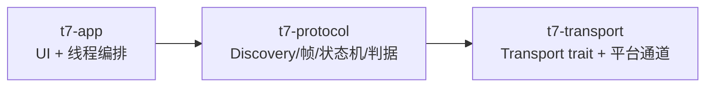
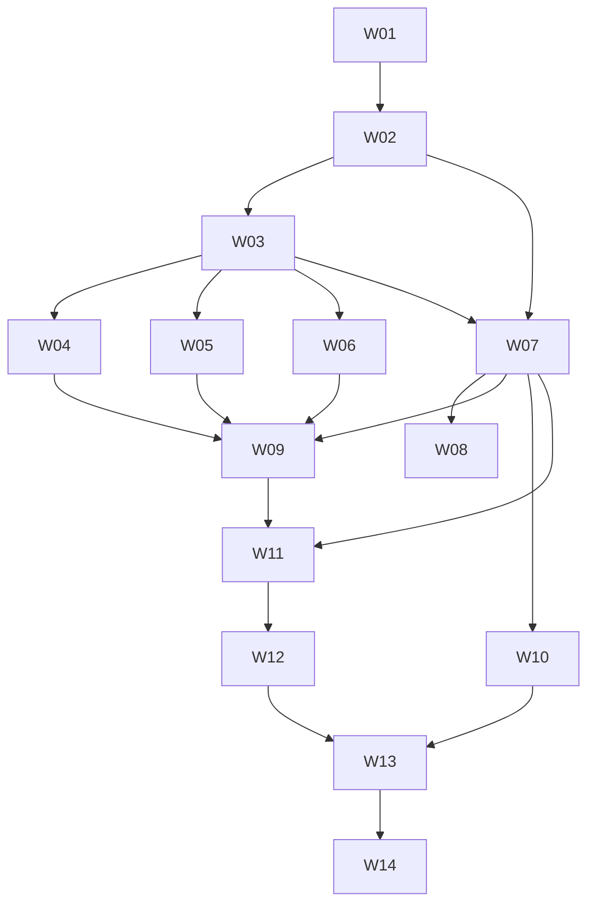

# t7 Shield GUI 客户端（t7-magician）实施计划

> **For agentic workers:** REQUIRED SUB-SKILL: 使用 superpowers:subagent-driven-development（推荐）或 superpowers:executing-plans 按任务逐个执行本计划。步骤使用 `- [ ]` 复选框跟踪。

**Goal:** 在 Rust + GTK4 + libadwaita 下实现 Linux 可用的 T7 Shield 解锁/口令校验 GUI 客户端，并让三个目标 crate、18 个测试锚点与 3 条验收屏障全部落地。

**Architecture:** cargo workspace 三 crate 单向依赖 `t7-app → t7-protocol → t7-transport`。`t7-protocol` 是纯协议层（零 UI 依赖）：Level-0 Discovery 解析、TCG 帧构造与响应解析、会话状态机、解锁判据；`t7-transport` 只提供 12 字节 CDB 收发通道（Linux `sg_io` 实现 + macOS 只读描述符侦察），不构造令牌流；`t7-app` 只做 UI 与线程编排，不构造 CDB 或令牌流。所有协议行为以 spec 为唯一权威；Linux 专属代码用 `cfg(target_os = "linux")` 门控，其纯逻辑（errno 映射、CDB 构造、描述符解析、重枚举轮询判据）下沉为跨平台可测函数。

**Tech Stack:** Rust（rustc 1.97，nix develop 提供）、GTK4 4.22 + libadwaita 1.9（gtk4-rs / libadwaita-rs，GtkBuilder `.ui` + `#[derive(CompositeTemplate)]`）、zeroize、rust-i18n、libc `ioctl(SG_IO)`（Linux）、IOKit FFI（macOS）、`python3` 验证工具链（audit/barriers）。

**Spec:** docs/specs/t7-magician/spec.md

---

## Global Constraints

以下为 spec 的项目级约束，逐条照抄（数值取自 spec §6，行为口径取自 §4/§5/§1.3）。**每个任务的验收隐含包含本节全部条款。**

- 平台：Linux 为全功能目标平台；macOS 只做只读描述符侦察，任何盘操作立即返回 `TransportError::Unavailable`（呈现码 `TransportUnavailable`），不重试、不退避、不轮询。
- 超时与性能：单条 SCSI 命令超时 **30 s**（`w4 = 0x1e`）；解锁全流程（Discovery + StartSession + StartTransaction + 4×`Set` + EndTransaction + EndSession，共 **10 条命令**）P95 ≤ **30 s**（不含重枚举等待）；UI 主线程单帧阻塞 ≤ **100 ms**；所有协议 I/O 在工作线程。
- 重枚举观察窗口 **30 s**，每 **500 ms** 轮询一次，最多 **60 次**；窗口耗尽即按 §4.8 判据给结论。
- 固定缓冲：响应 **2048 B**、Discovery **4096 B**；禁止按响应内容动态扩容。
- 并发：单飞（每设备同时最多 1 个在飞操作，新请求返回 `AppError::Busy`）；命令队列上限 1；工作线程每设备 1 个；应用同时受理设备上限 **8 个**。
- 零自动重放：协议层任何失败都不自动重发命令（D11）；UI 层允许用户显式重试，口令被拒最多 **3 次**，超过后本次会话禁用「解锁」入口，直到重新打开对话框。
- 取消语义：操作进行中关闭窗口 → 当前命令返回后停止后续步骤（不做命令级中断）；已建立会话时尽力 EndSession；取消不改变 §5 错误分类。
- 安全：口令缓冲在报文构造完成后立即 zeroize，并在 `Drop` 时二次清零；**零日志（口令内容与长度都不写日志）**、零剪贴板、零持久化；诊断信息只保留内存环形缓冲上限 **512 条**，导出前再次脱敏；Linux 上不请求提权（权限不足返回 `PermissionDenied`）。
- i18n：默认 `zh-CN`，提供 `en`；所有用户可见文案经 i18n 键渲染，**代码中不得内联可显示字符串**。
- 范围排除：固件更新、安全擦除/FactoryReset、0xFD 私有通道、Windows、A 路以外协议路径、性能基准报告；**客户端不得发送重枚举触发命令（含 `E8 00 00 00 00 00`）**（§4.8、AC-007；注意协议仓库 `analysis/protocol-notes.md` §12.4/§12.5 的解锁器建议与本规格不同，**以 spec 为准**）。
- ComID 必须从 Level-0 Discovery 的 Opal SSC 描述符运行时解析（D03）；实测值 `0x1004` **不得**写成生产代码常量，测试中只作测试局部变量。
- 提交纪律（仓库 `AGENTS.md`）：提交消息中文、conventional commits；默认 GPG 签名 `git commit -S`；**禁止任何 AI 标识**；spec 与代码同批提交。
- 环境：所有构建/测试命令在 `nix develop` 内执行（提供 rustc/cargo/clippy/rustfmt/gtk4/libadwaita/pkg-config）。

---

## 文件结构总览

每个文件一个明确职责；文件只会被其所属任务创建/修改（`Interfaces` 段声明跨任务契约）。

```
Cargo.toml                                  # workspace：members = crates/*；workspace.dependencies / lints
rustfmt.toml                                # 格式化约定（edition、max_width=100）
clippy.toml                                 # 少量 lint 阈值（无 pedantic 全局开启）

crates/t7-protocol/                         # 纯协议层，零 UI 依赖（依赖 t7-transport）
  Cargo.toml
  src/lib.rs                                # 模块声明与公开导出（唯一对外门面）
  src/error.rs                              # ProtocolError（§5 全变体）+ UnlockStep
  src/atom.rs                               # §4.10 原子编码/解码（token/tiny/窄整数/短中长字节串/UID）
  src/uid.rs                                # §4.10 UID 表常量
  src/frame.rs                              # 报文头 Make/Parse、状态列表单/双变体、方法状态字节、token[i] 遍历
  src/discovery.rs                          # identify_device / parse_level0 / LockingFlags（REQ-001/002）
  src/session.rs                            # start_session_payload / validate_password_payload / session_ids_from_response（REQ-006/009）
  src/transaction.rs                        # FB / 4×Set / FC / FA 载荷构造（REQ-007）
  src/unlock.rs                             # evaluate_unlock / ReEnumerationObservation / UnlockEvidence（REQ-008）
  src/runner.rs                             # 会话状态机 + 命令编排 + 中止路径（§3.3、REQ-011 占位错误）
  src/password.rs                           # Password(Zeroizing<Vec<u8>>) 及其生命周期
  tests/                                    # 集成测试（黄金向量、状态机、错误路径）；锚点测试写在 src/*.rs 的 #[cfg(test)] 或此处均可，但必须可 grep

crates/t7-transport/                        # 传输层，唯一权威 Transport trait（依赖 libc/io-kit-sys/core-foundation）
  Cargo.toml
  src/lib.rs
  src/transport.rs                          # ScsiCdb / Direction / DeviceTarget / Transport trait / TransportError
  src/cdb.rs                                # cdb_security_in / cdb_security_out（§4.3 逐字节）
  src/sense.rs                              # SenseData + sense/SCSI 状态 → TransportError 映射（跨平台纯函数）
  src/errno_map.rs                          # OS 错误码 → TransportError 映射（跨平台纯函数）
  src/usb_descriptor.rs                     # UsbDescriptorSummary/AlternateSetting/Endpoint + parse_config_descriptor（跨平台纯函数 + fixture）
  src/reenumeration.rs                      # 轮询判据（纯逻辑）+ 观察采样结构
  src/macos/mod.rs                          # MacOsDiscovery（cfg target_os="macos"）
  src/macos/iokit.rs                        # IOKit 注册表 + IOUSBDeviceInterface 插件 FFI（cfg macos）
  src/linux/mod.rs                          # LinuxSgIo（cfg target_os="linux"）
  src/linux/sg_io.rs                        # SG_IO ioctl 薄层（cfg linux）
  src/linux/scan.rs                         # sysfs 设备扫描与重枚举观察（cfg linux）

crates/t7-app/                              # GTK4 + libadwaita UI（依赖 t7-protocol、t7-transport）
  Cargo.toml
  src/main.rs                               # adw::Application 启动、locale 初始化、空口令/入口装配
  src/main_window.rs                        # MainWindow（CompositeTemplate）
  src/password_dialog.rs                    # PasswordDialog（CompositeTemplate）+ 提交校验
  src/ui/main_window.ui                     # 主窗口模板（结构无字面量）
  src/ui/password_dialog.ui                 # 口令对话框模板（结构无字面量）
  src/controller.rs                         # 入口启用规则 + 单飞 + 口令校验（纯逻辑，无 GTK）
  src/jobs.rs                               # 工作线程 + channel + AppEvent 投递（spawn_device_job）
  src/presentation.rs                       # AppError → 呈现码映射（§4.13 表）
  src/observation.rs                        # ReEnumerationSample → ReEnumerationObservation 纯映射 + 轮询驱动
  src/diagnostics.rs                        # 内存环形缓冲（512 条）+ 脱敏导出
  locales/zh-CN.yml                         # 默认语言
  locales/en.yml                            # 英文资源
```

依赖方向（单向，§3.1）：



---

## 关键设计决策（实施前锁定，任务按此执行）

**K1. macOS 描述符侦察选型：IOKit 注册表 + `IOUSBDeviceInterface` 插件的 `GetConfigurationDescriptorPtr`（不选 rusb/libusb，不选 nusb）。**

理由与实测证据（本机 macOS 26.6 / arm64，设备处于锁定态时实测）：

1. 设备接入后接口已被系统驱动独占：`ioreg -r -c IOUSBHostInterface` 显示 `"UsbExclusiveOwner" = "IOUSBMassStorageInterfaceNub"`（另有 `bInterfaceClass = 8`、`bInterfaceSubClass = 6`、`bAlternateSetting = 1`、`bInterfaceProtocol = 98 (0x62)`、`bNumEndpoints = 4`）。任何走 `open()` + `claim_interface()` 的库（libusb/rusb、nusb）都会与该 kext 争用同一接口，正是 `issues/2026-09-14-macOS传输通道.md` 记录的平台事实。
2. IOKit 头文件对 `GetConfigurationDescriptorPtr` 的原文（Xcode SDK `IOKit.framework/Headers/usb/IOUSBLib.h:1151-1161`）：*"Note that this will point to the data as received from the USB bus … **The device does not have to be open to use this function.**"* → 该路径只读描述符，不打开设备、不 claim、不 seize，不需要 root/entitlement/DriverKit。
3. 已用一次性 Swift 探针在**锁定态真机**上实测成功：`IOServiceMatching("IOUSBHostDevice")` → `IOCreatePlugInInterfaceForService(kIOUSBDeviceUserClientTypeID, kIOCFPlugInInterfaceID)` → `QueryInterface(kIOUSBDeviceInterfaceID100)` → `GetConfigurationDescriptorPtr(0)` 返回 `kIOReturnSuccess`，读出 **121 字节**真实配置描述符（见附录 B），其中恰好是 1 个配置 / 1 个接口 / 2 个备用设置（proto `0x50` 与 `0x62`），与 spec §4.5 的正常示例逐项一致。
4. 代价对比：rusb 需要给 flake 增加 `libusb1` 原生依赖并链接动态库，且无法保证只读路径；`nusb` 的配置描述符需要 `open()`。IOKit 方案只需 `io-kit-sys` + `core-foundation`（纯 Rust 绑定）+ 约 40 行手写 `IOUSBLib` FFI（`io-kit-sys` 不覆盖该插件接口），运行期零额外系统依赖。

**K2. macOS 只读路径与纯逻辑分离。** `src/macos/iokit.rs` 只负责「拿到描述符字节」；字节 → `UsbDescriptorSummary` 的解析放在跨平台的 `src/usb_descriptor.rs`，用附录 B 的真实描述符做黄金 fixture，在 macOS 与 Linux 上都能跑。

**K3. Linux 设备发现与观察走 sysfs（不引入 udev/libudev 依赖）。** `/sys/class/scsi_generic/sgN/device` 逐级向上找含 `idVendor`/`idProduct` 的 USB 目录，匹配 `0x04e8` 后取节点路径；重枚举观察读 `/proc/partitions`、`/sys/block/*/`（子分区出现）与 `/proc/mounts`（挂载卷）。全部为世界可读文件，不需要提权。

**K4. Linux 代码的 cfg 门控与「薄层化」。** 只有 `linux/sg_io.rs` 里的 `ioctl` 调用是 Linux 独有且不可跨平台测试的；以下全部跨平台可测：CDB 组装（`cdb.rs`）、`SgIoHdr` 结构构造（自建 `#[repr(C)]` 类型，`sg_io.rs` 内仅剩 syscall 包装）、sense 解析与 errno 映射（`sense.rs`/`errno_map.rs`）、重枚举轮询判据（`reenumeration.rs`）。任何新逻辑优先放进跨平台模块；`cfg(linux)` 代码越薄越好。本机（macOS）无法编译验证 Linux 分支，因此 Linux 分支的验收分两级：**结构级**（`cargo check` 在 macOS 上确认 cfg 正确剥离、跨平台部分全绿）与**真机级**（见「验证边界」V01）。

**K5. i18n 用 rust-i18n，`.ui` 只承载结构、不写字面量。** `i18n!("locales", fallback = "zh-CN")` 编译期内嵌 `locales/*.yml`；GTK 模板里的 `label`/`title` 等显示文案在 `setup()` 里用 `t!("key")` 赋值。这样：(a) 不引入 gettext 运行时与 `.mo` 编译链；(b) AC-015「代码无内联可显示字符串」可以机器校验——`.ui` 中除 `id`/`class`/属性名外不出现中英文字面量，全部文案键集中在 `locales/*.yml`。

**K6. 测试必须可无头运行。** 屏障会执行 `cargo test -p t7-app`，因此应用层可测逻辑（入口启用、单飞、空口令、口令清零、呈现码映射、模板子件）全部做成**不依赖 display 的纯逻辑或 XML 断言**；只有真窗口实例化测试允许在 `gtk::init()` 失败时打印跳过原因（不 `#[ignore]`，避免屏障默认跳过）。协议层与传输层测试不允许跳过。

**K7. 口令缓冲归 t7-protocol 所有。** `Password(Zeroizing<Vec<u8>>)` 定义在 `t7-protocol/src/password.rs`（帧构造与「构造完成后立即 zeroize」同一处实现），`t7-app` 只持有并使用它，不得复制明文到 `String`。

---

## 任务清单总表

| 编号 | 一句话 | 依赖 | 可并行于 |
|---|---|---|---|
| W01 | workspace 与三 crate 脚手架 + 工具链配置（fmt/clippy/测试全绿） | — | — |
| W02 | t7-protocol 原子编解码与 `ProtocolError`/`UnlockStep` 全量定义（§4.10） | W01 | — |
| W03 | t7-protocol 报文头 Make/Parse、状态列表变体、方法状态字节、`token[i]` 遍历 | W02 | — |
| W04 | t7-protocol Discovery 解析与设备识别（REQ-001/002） | W03 | W05、W06 |
| W05 | t7-protocol StartSession / ValidatePassword / 会话号映射（REQ-006/009） | W03 | W04、W06 |
| W06 | t7-protocol 事务序列 4×`Set` + FB/FC/FA（REQ-007） | W03 | W04、W05 |
| W07 | t7-transport trait / CDB / 错误模型 / 纯映射 / 描述符解析 | W02、W03 | — |
| W08 | t7-transport macOS IOKit 只读侦察（REQ-005） | W07 | W09 |
| W09 | t7-protocol 判据、状态机编排、中止路径、占位错误（REQ-008/011） | W04、W05、W06、W07 | W08 |
| W10 | t7-transport Linux `sg_io` + sysfs 扫描 + 重枚举观察（REQ-004） | W07 | W11 |
| W11 | t7-app i18n / 呈现码 / 纯控制器（入口启用、单飞、空口令、未知 PID） | W07、W09 | W10 |
| W12 | t7-app UI 模板 + CompositeTemplate + 口令生命周期 + 工作线程 | W11 | — |
| W13 | t7-app 主流程装配（设备卡片、进度、结果、取消、诊断导出、重枚举联动） | W12、W10 | — |
| W14 | 收尾：workspace 全绿 + 三屏障全绿 + spec 切 Authoritative + README + 同批提交 | W13 | — |



执行波次（供 subagent-driven-development 使用）：`[W01] → [W02] → [W03] → [W04 ∥ W05 ∥ W06] → [W07] → [W08 ∥ W09] → [W10 ∥ W11] → [W12] → [W13] → [W14]`。

**并发波次内的 `lib.rs` 追加规则（唯一共享可变边界）：** 每个任务只向本 crate 的 `lib.rs` 追加**自己的一行** `mod <name>;`（放在模块声明区末尾），不改动他人已写行。若同一波次内两个任务会同时改同一个 `lib.rs`（仅 `[W04 ∥ W05 ∥ W06]` 这一波：三者都在 `crates/t7-protocol/src/lib.rs` 追加），由先完成者追加后经 `hub` 通知同波其它任务「已落地，请 rebase 后追加」，单行追加不引入语义冲突；若执行环境不支持该协调，则把该波退化为串行 `[W04] → [W05] → [W06]`（其余波次无共享文件冲突：`[W08 ∥ W09]` 分属不同 crate，`[W10 ∥ W11]` 分属不同 crate）。

---

## W01：workspace 骨架与三 crate 脚手架

**依赖:** 无。**验收独立：** 三个 crate 可构建、可测试、可 lint。

**Files:**
- 新建 `Cargo.toml`（workspace 根）、`rustfmt.toml`、`clippy.toml`
- 新建 `crates/t7-protocol/Cargo.toml`、`crates/t7-protocol/src/lib.rs`
- 新建 `crates/t7-transport/Cargo.toml`、`crates/t7-transport/src/lib.rs`
- 新建 `crates/t7-app/Cargo.toml`、`crates/t7-app/src/main.rs`
- 修改 `.gitignore`（确认 `target/` 已忽略；无需其它改动）

**Interfaces:**
- Produces：三个 crate 名 `t7-protocol`、`t7-transport`、`t7-app`（改名前必须回改 `docs/specs/t7-magician/tools/audit_manifest.json` 的 `source_globs` 与 `barriers`，**禁止改名**）；workspace 级 `[workspace.lints.rust]`/`[workspace.lints.clippy]`；`edition = "2021"`（或当前 rustc 稳定版默认新 edition，全 crate 一致）。
- Produces：`t7-protocol` 依赖 `t7-transport`（path 依赖）；`t7-app` 依赖 `t7-protocol`、`t7-transport`。反向依赖禁止。

**Steps:**
1. [ ] 写 `Cargo.toml`（workspace）：`members = ["crates/*"]`、`resolver = "2"`、`[workspace.lints.clippy]` 至少含 `correctness = "deny"`、`[profile.release] lto = "thin"`。
2. [ ] 写三个 crate 的 `Cargo.toml`：`t7-protocol` 依赖 `t7-transport`；`t7-transport` 依赖 `libc`（Linux 用）；`t7-app` 依赖 `gtk4`、`libadwaita`、`t7-protocol`、`t7-transport`、`zeroize`、`rust-i18n`、`async-channel`（版本用 `cargo add` 取当前可解析版本，并逐个核对最小版本特性：GTK 相关 crate 需满足 gtk4 4.22 / libadwaita 1.9 的最低特性组合，如 `gtk4` 的 `v4_10` 与 `libadwaita` 的 `v1_6`；**不要**在计划里锁死具体版本号，以 `nix develop` 内实际解析结果为准）。
3. [ ] `t7-protocol/src/lib.rs`、`t7-transport/src/lib.rs` 只声明本任务实际创建的内容（crate 级文档注释 + 本任务新建的模块）；**不要**预留 `todo!()`、占位函数或空模块文件——各模块由后续任务在本 crate 的 `lib.rs` 中追加自己的 `mod` 声明（并发波次内的追加规则见「任务清单总表」下方说明）。
4. [ ] `t7-app/src/main.rs` 写最小可运行 `adw::Application`（`run()` 返回 `glib::ExitCode`），不带任何协议逻辑。
5. [ ] 写一个最小冒烟测试（如 `t7-protocol` 的 `fn test_crate_builds()` 断言常量可见），确保 `cargo test -p <crate>` 在每个 crate 上都真的有测试可跑（避免「0 tests 也算绿」）。
6. [ ] 运行并确认全绿：
   ```bash
   nix develop --command cargo build --workspace
   nix develop --command cargo test --workspace
   nix develop --command cargo fmt --all -- --check
   nix develop --command cargo clippy --workspace --all-targets -- -D warnings
   ```
7. [ ] 提交：`git commit -S -m "chore: 建立 t7-magician cargo workspace 与三 crate 骨架"`。

**Acceptance:** 上述 4 条命令退出码 0；`cargo metadata --format-version 1` 中三个 crate 的依赖方向符合 `app → protocol → transport`。

**易错点:** 三个 crate 目录名必须与 manifest 的 `source_globs`（`crates/t7-protocol/**/*.rs` 等）完全一致；`barriers.py` 用 `[ -d crates/t7-protocol ]` 探测，目录一旦存在即执行真测试，所以 W01 之后屏障第一步就要求 `cargo test -p t7-protocol` 真通过。

---

## W02：t7-protocol 原子编解码与错误类型全量定义

**依赖:** W01。**验收独立：** §4.10 编码/解码表逐行有测试。

**Files:**
- 新建 `crates/t7-protocol/src/error.rs`、`src/atom.rs`、`src/uid.rs`
- 修改 `crates/t7-protocol/src/lib.rs`（声明模块）

**Interfaces:**
- Produces（`error.rs`，spec §5 全变体，**后续任务不得再改本文件的结构**）：
  - `pub enum ProtocolError { DiscoveryTooShort { len: usize }, NoOpalSscDescriptor, LockingDescriptorMissing, UnsupportedSecurityProtocol { proto: u8, sense: SenseData }, SessionRejected { status_byte: u8 }, EmptyResponse { step: UnlockStep }, UnexpectedResponseLength { step: UnlockStep, expected: usize, actual: usize }, SessionIdsMissing, PasswordOperationUnspecified }`
  - `pub enum UnlockStep { StartSession, StartTransaction, SetMbrControl, SetReadLocked, SetWriteLocked, SetDataStore, EndTransaction, EndSession }`（`EmptyResponse` 的示例值取 spec §4.7 的 `SetReadLocked`；`StartSession` 只用于 `UnexpectedResponseLength` 的步骤标识，**进度上报只覆盖 7 条命令**——spec §4.13「6 类步骤」按 §4.7 表格的 6 条理解 + EndSession 收尾，见「待澄清点 C5」）
  - `impl std::fmt::Display for ProtocolError`（诊断文本不含口令）
  - 说明：`ScsiCheckCondition` → `UnsupportedSecurityProtocol` 的分类不放在 `error.rs`，统一由 W09 的 `runner::classify_transport_error(err, step)` 实现（该处同时掌握步骤标识与「短应答/长度不符」的转换），避免同一判定散落两处。
- Produces（`uid.rs`）：spec §4.10 UID 表 8 项常量（`SMUID`、`LOCKINGSP`、`ADMIN1`、`MBRCONTROL`、`LOCKINGRANGE_GLOBAL`、`DATASTORE`、`STARTSESSION_METHOD`、`SET_METHOD`）。
- Produces（`atom.rs`）：
  - `pub fn tiny_uint(v: u8) -> Vec<u8>`（≤ `0x3F`）、`pub fn uint(v: u64) -> Vec<u8>`（按宽度选 `0x81`/`0x82`/`0x83`/`0x84` + BE 字节）
  - `pub fn bytes_atom(data: &[u8]) -> Vec<u8>`（`len ≤ 0x0F` → `0xA0|len`；`≤ 0x7FF` → `0xD0|(len>>8), len&0xFF`；否则 `0xE2` + BE32(len)）
  - `pub fn uid_atom(u: &[u8; 8]) -> Vec<u8>`（`0xA8` + 8 字节）
  - `pub enum Atom<'a> { Token(u8), Uint(u64), Bytes(&'a [u8]) }` + `pub fn walk_atoms(buf: &[u8]) -> Result<Vec<Atom<'_>>, ProtocolError>`（解码：`< 0x80` 裸 token 值 = `b & 0x3F`；`0x80–0xBF` 短原子长度 = `b & 0x0F`；`0xC0–0xDF` 中原子长度 = `((b & 0x07) << 8) | next`；`0xE0–0xEF` 长原子长度 = 后 3 字节 BE；`0xF0–0xFF` 控制 token）
  - `pub fn atom_u64(a: &Atom) -> Result<u64, ProtocolError>`：短原子长度 8 → **小端**解释；其余长度 → **大端**；中/长原子 → `Err(SessionIdsMissing)`（§4.10 解码表）

**Steps（TDD）:**
1. [x] 先写失败测试（`src/atom.rs` 的 `#[cfg(test)]`）：`tiny_uint(0) == [0x00]`、`tiny_uint(2) == [0x02]`、`uint(0x40) == [0x81,0x40]`、`bytes_atom(b"ABC") == [0xA3,b'A',b'B',b'C']`、`bytes_atom(&[b'A';32])[..2] == [0xD0,0x20]`、16 字节 → `[0xD0,0x10]`、`uid_atom(MBRCONTROL) == A8 00 00 08 03 00 00 00 01`、`walk_atoms` 对 8 字节短原子按小端取值（`88 11 22 33 44 55 66 77 88` → `0x8877665544332211`）、中/长原子取数值 → `Err(SessionIdsMissing)`。
2. [x] 运行 `nix develop --command cargo test -p t7-protocol`，确认因函数未定义而 FAIL。
3. [x] 实现 `atom.rs`/`uid.rs`/`error.rs` 至测试通过（不写任何额外编解码形式，§4.10 未列出的形式一律不实现）。
4. [x] 运行 `cargo test -p t7-protocol`、`cargo clippy -p t7-protocol --all-targets -- -D warnings`、`cargo fmt --all`，全绿。
5. [x] 提交：`git commit -S -m "feat: 实现 t7-protocol 原子编解码与错误模型"`。

**Acceptance:** 上述编码逐条断言通过；`atom.rs` 中不存在 §4.10 未列出的编码分支。

---

## W03：t7-protocol 报文头与响应解析

**依赖:** W02。**验收独立：** 报文头三个长度域与总长公式、状态列表变体、方法状态字节、`token[i]` 遍历逐条有测试。

**Files:**
- 新建 `crates/t7-protocol/src/frame.rs`
- 修改 `crates/t7-protocol/src/lib.rs`

**Interfaces:**
- Produces：
  - `pub fn make_payload(comid: u16, tsn: [u8; 4], hsn: [u8; 4], tokens: &[u8]) -> Vec<u8>`（§4.10 头表；总长 = `(0x38 + len(tokens) + 3) & !3`，尾部 0 填充）
  - `pub struct TcgResponse<'a> { /* 原始缓冲 + 解析出的头字段 */ }` + `pub fn parse_response(buf: &[u8]) -> Option<TcgResponse<'_>>`：读 `+0x04` ComID 回显、`+0x10` ComPacket 长度、`+0x14`/`+0x18`、`+0x28`、`+0x34` = `data_len`；当 `buf.len() < 0x38` 或 `0x38 + data_len > buf.len()` 时返回 `None`（调用方按 §4.3 转成 `TransportError::ShortResponse { got }` 或 `UnexpectedResponseLength`，见 W09）
  - `pub enum StatusListShape { Single, Double }`、`pub fn detect_status_list_shape(resp: &TcgResponse) -> StatusListShape`（StartSession 应答尾部回显 10 字节双列表 → `Double`，否则 `Single`；每次操作只判定一次）
  - `impl TcgResponse<'_>`：
    - `pub fn expect_data_len(&self, expected: usize, step: UnlockStep) -> Result<(), ProtocolError>`：`data_len != expected` → `Err(UnexpectedResponseLength { step, expected, actual })`；`data_len == 0` → `Err(EmptyResponse { step })`（**唯一实现处**；只用于 StartSession `expected = 37` 与 `Set` `expected = 8`，**不得**用于 FB/FC/FA——§5 明确该三类命令的空应答不作为失败判据）
    - `pub fn status_byte(&self) -> Option<u8>`（§4.10 表：`data_len ≥ 5` 且末字节 `0xF1` 且 `data[data_len-5] == 0xF0` → `data[data_len-4]`；`data_len == 2` 且首字节 ∈ `{0xFB,0xFC}` → `0`；`data_len == 1` 且首字节 `0xFA` → `0`；`data_len == 0` → `None`）
    - `pub fn tokens(&self) -> Result<Vec<Atom<'_>>, ProtocolError>`（从 `+0x38` 遍历 `data_len` 字节，**在 `data_len - 5` 处停止**）
    - `pub fn status_list(&self, shape: StatusListShape) -> &[u8]`
- Consumes：`atom::walk_atoms`、`ProtocolError`。

**Steps（TDD）:**
1. [x] 写失败测试：先在 `#[cfg(test)]` 内写测试助手 `synthetic_response(comid, body) -> Vec<u8>`（按附录 A4.1 的规则填充帧头），再用附录 A1 的 128 字节 StartSession 报文断言 `make_payload` 逐字节相等、`pkt[0x10..0x14] == BE32(总长-0x14)`、`pkt[0x28..0x2C] == BE32(总长-0x2C)`、`pkt[0x34..0x38] == BE32(令牌流长度)`；对附录 A4.1 的 37 字节体断言 `status_byte() == Some(0)` 与 `tokens()` 序列 `[ctl, atom, atom, ctl, atom, atom, ctl, ctl]`；对 `data_len = 2`/`1`/`0` 三种 fixture 断言状态字节取法与 `None`。
2. [x] 运行测试确认 FAIL。
3. [x] 实现 `frame.rs`。
4. [x] 测试 + clippy + fmt 全绿；提交 `git commit -S -m "feat: 实现 TCG 报文头构造与响应解析"`。

**易错点:** 遍历必须在 `data_len - 5` 停止（否则把状态列表当参数）；8 字节原子的小端解释必须照抄（D04 的后果链依赖它）。

---

## W04：t7-protocol Discovery 与设备识别

**依赖:** W03。**锚点:** `test_level0_parses_base_comid`（必须可 grep，写在 `src/discovery.rs`）。

**Files:**
- 新建 `crates/t7-protocol/src/discovery.rs`
- 修改 `crates/t7-protocol/src/lib.rs`

**Interfaces:**
- Consumes：`frame::parse_response`、`ProtocolError`。
- Produces（spec §4.1/§4.2 契约）：
  - `pub const VENDOR_ID: u16 = 0x04e8; pub const PID_LOCKED: u16 = 0x61fc; pub const PID_UNLOCKED: u16 = 0x61fb;`
  - `pub fn identify_device(vid: u16, pid: u16) -> Option<DeviceState>`
  - `pub enum DeviceState { Locked, Unlocked, ReEnumerating }`
  - `pub struct FeatureDescriptor { pub feature: u16, pub version: u8, pub data: Vec<u8> }`
  - `pub struct LockingFlags { pub raw: u8 }` + `locked()`（bit2）/`mbr_enabled()`（bit4）/`mbr_done()`（bit5）
  - `pub struct Discovery { pub base_comid: u16, pub locking: LockingFlags, pub descriptors: Vec<FeatureDescriptor> }`
  - `pub fn parse_level0(buf: &[u8]) -> Result<Discovery, ProtocolError>`
  - `pub fn discovery_cdb() -> t7_transport::ScsiCdb`：实现只能是 `cdb_security_in(DISCOVERY_SP_SPECIFIC, DISCOVERY_ALLOC_LEN)` 的一次调用（即 `A2 01 00 01 00 00 00 00 10 00 00 00`）。归属固定：泛化构造 `cdb_security_in/out` 归 `t7-transport::cdb`（W07），discovery 的两个常量与 `discovery_cdb()` 归 `t7-protocol::discovery`（本任务），**不得在两处各写一份 CDB 字节**。
- 遍历规则（spec 未明确定义终止条件，本计划统一为）：从 `0x30` 起，每项 `{BE16 feature, u8 version, u8 len}` + `len` 字节，步长 `4 + len`；遇 `feature == 0x0000`、剩余不足 4 字节、或 `4 + len` 越界即停止。`len(buf) < 0x31` → `DiscoveryTooShort { len }`；无 `0x0203` → `NoOpalSscDescriptor`；有 `0x0203` 无 `0x0002` → `LockingDescriptorMissing`（不得推断锁定状态）。
- `base_comid` = Opal SSC V2.00（feature `0x0203`）描述符起点 `+4` 的 BE16；`LockingFlags.raw` = Locking（feature `0x0002`）描述符起点 `+4` 的字节。

**Steps（TDD）:**
1. [x] 先写 `fn test_level0_parses_base_comid()`（失败）：用附录 C 的 fixture（来源 `t7Shield-protocol/analysis/probe-linux.raw`，经 `tools/unlock/unlock.py` 固化）断言 `base_comid == 0x1004`、`locking.locked() == true`（raw `0x1f`）、`descriptors` 含 `0x0203` 与 `0x0002`；同文件内追加三个边界断言：16 字节响应 → `DiscoveryTooShort { len: 16 }`；只有 TPer+Locking 描述符 → `NoOpalSscDescriptor`；有 `0x0203` 无 `0x0002` → `LockingDescriptorMissing`。
2. [x] 追加 `fn test_unknown_pid_is_rejected()`（本 crate 侧只测 `identify_device`）：`(0x04e8, 0x61fc) → Locked`、`(0x04e8, 0x61fb) → Unlocked`、`(0x04e8, 0x61ff) → None`、`(0x1234, 0x61fc) → None`。
3. [x] 运行 `cargo test -p t7-protocol`，确认 FAIL。
4. [x] 实现 `discovery.rs`；测试全绿。
5. [x] AC-002 自查：`grep -rn "0x1004" crates/t7-protocol/src/` 只允许出现在 `#[cfg(test)]` 内，且以测试局部变量形式（如 `let observed_comid: u16 = 0x1004;`）出现；`base_comid` 在生产路径只来自 `parse_level0` 返回值。
6. [x] 提交：`git commit -S -m "feat: 实现 Level-0 Discovery 解析与设备识别"`。

**Acceptance:** `test_level0_parses_base_comid` 可 grep 且通过；生产代码零 ComID 硬编码。

---

## W05：t7-protocol StartSession 与口令校验

**依赖:** W03。**锚点:** `test_start_session_frame_golden`、`test_session_ids_swap_mapping`、`test_password_rejected_status_byte_one`。

**Files:**
- 新建 `crates/t7-protocol/src/session.rs`、`src/password.rs`
- 修改 `crates/t7-protocol/src/lib.rs`

**Interfaces:**
- Consumes：`atom::*`、`frame::make_payload`、UID 常量。
- Produces（spec §4.6/§4.9 契约）：
  - `pub struct Password(Zeroizing<Vec<u8>>)`：`pub fn new(bytes: Vec<u8>) -> Self`、`pub fn expose(&self) -> &[u8]`、`pub fn is_empty(&self) -> bool`、`pub fn zeroize_now(&mut self)`；`Drop` 二次清零。
  - `pub struct StartSessionRequest<'a> { pub base_comid: u16, pub host_challenge: &'a [u8], pub host_session_number: u8, pub spid: [u8; 8], pub write: bool, pub authority: [u8; 8] }`
  - `pub fn start_session_payload(req: &StartSessionRequest) -> Vec<u8>`（口令明文进 HostChallenge，不派生不哈希；**签名与 spec §4.6 逐字一致**——StartSession 自身永远使用单列表形态，形状尚未判定）
  - `pub fn validate_password_payload(req: &StartSessionRequest) -> Vec<u8>`（与 `start_session_payload` 同构；差异只在调用方不发 StartTransaction）
  - `pub struct SessionIds { pub tsn: [u8; 4], pub hsn: [u8; 4], pub base_comid: u16, pub shape: StatusListShape }`：前两个字段映射见下；`base_comid` 取应答头 `+0x04` 回显的 ComID，`shape` 取 `detect_status_list_shape(resp)`。后两个字段是本计划对 spec §4.7 签名的必要补齐（`end_transaction_payload(ids)` / `end_session_payload(ids)` 的签名里没有 ComID 参数，而报文头必须有 ComID）——见「待澄清点 C7」。
  - `pub fn session_ids_from_response(resp: &TcgResponse) -> Result<SessionIds, ProtocolError>`：`hsn` = `token[4]`、`tsn` = `token[5]`（**唯一权威映射**，8 字节原子按小端取低 32 位后按大端写 4 字节），缺失或类型不符 → `SessionIdsMissing`
  - `pub struct ValidateOutcome { pub accepted: bool, pub status_byte: u8 }` + `pub fn validate_outcome(resp: &TcgResponse) -> Result<ValidateOutcome, ProtocolError>`
- 期望长度判据统一走 W03 的 `TcgResponse::expect_data_len(resp, 37, UnlockStep::StartSession)`（StartSession 应答 `data_len = 37`；步骤标识用 `UnlockStep::StartSession`，spec §5 的 `UnexpectedResponseLength { step, expected, actual }` 由该助手产出）。

**Steps（TDD）:**
1. [x] 写 `fn test_start_session_frame_golden()`（失败）：口令取 **16 字节**（`b"0123456789abcdef"`），断言 `start_session_payload` 与附录 A 的 128 字节黄金向量**逐字节相等**；再断言 3 字节口令（`b"ABC"`）产出 spec §4.10 记录的三段式（`... f2 00 a3 41 42 43 f3 ...`）、空口令**不构造** HostChallenge 块（D02：`F2 00 … F3` 整段缺席）。
2. [x] 写 `fn test_session_ids_swap_mapping()`（失败）：用附录 A 的 37 字节应答断言 `tsn == 00 00 10 1A`、`hsn == 00 00 00 01`；再断言「按 8 字节小端规则解读 token[4]/token[5]」不得产生交换后的值，并用一个把映射写反的负例夹具断言交换后的会话号与本实现结果不同（防止映射回归）。
3. [x] 写 `fn test_password_rejected_status_byte_one()`（失败）：附录 A 的假口令应答（`data_len = 37`、状态字节 `1`）→ `validate_outcome(...) == ValidateOutcome { accepted: false, status_byte: 1 }`；真口令 → `accepted: true, status_byte: 0`。
4. [x] 实现 `session.rs`/`password.rs`；三条锚点测试 + `cargo clippy -p t7-protocol --all-targets -- -D warnings` 全绿。
5. [x] 提交：`git commit -S -m "feat: 实现 StartSession 帧构造、会话号映射与口令校验"`。

**易错点:** 16 字节口令走**中字节串** `D0 10`（§4.10「16–2047 用中字节串」），不要写成 `A0 10`——这是最容易错的一处，黄金向量会拦住它。

---

## W06：t7-protocol 事务序列（4×`Set` + 收尾）

**依赖:** W03。**锚点:** `test_set_datastore_row_two_frame_golden`、`test_empty_response_is_fatal`、`test_unexpected_response_length_rejected`。

**Files:**
- 新建 `crates/t7-protocol/src/transaction.rs`
- 修改 `crates/t7-protocol/src/lib.rs`

**Interfaces:**
- Produces（spec §4.7 契约，**签名逐字一致**；ComID 与状态列表形态由 `ids`（`base_comid`/`shape`）提供，理由见「待澄清点 C7」）：
  - `pub struct SetCell { pub object: [u8; 8], pub column: u8, pub value: u8 }`
  - `pub struct SetRow { pub object: [u8; 8], pub row: u64, pub value: Vec<u8> }`
  - `pub fn start_transaction_payload(base_comid: u16, ids: &SessionIds) -> Vec<u8>`（令牌流 `FB 00` + 状态列表；总长 64）
  - `pub fn set_cell_payload(c: &SetCell, ids: &SessionIds) -> Vec<u8>`（总长 92）
  - `pub fn set_row_payload(r: &SetRow, ids: &SessionIds) -> Vec<u8>`（总长 92）
  - `pub fn end_transaction_payload(ids: &SessionIds) -> Vec<u8>`（`FC 00` + 状态列表；总长 64）
  - `pub fn end_session_payload(ids: &SessionIds) -> Vec<u8>`（`FA` + 状态列表；总长 64）
  - `pub fn unlock_sets() -> [UnlockSetOp; 4]`：按 §4.7 表固定顺序返回 4 个操作描述（`SetCell(MBRCONTROL, 列 2, 1)`、`SetCell(LOCKINGRANGE_GLOBAL, 列 7, 0)`、`SetCell(LOCKINGRANGE_GLOBAL, 列 8, 0)`、`SetRow(DATASTORE, 行 2, [0x03])`），供编排层与测试共同引用，**禁止在别处再写一份顺序表**；`pub enum UnlockSetOp { Cell(SetCell), Row(SetRow) }`。
- `Set` 类 InvokingID 是目标对象 UID；报文 `+0x14 = TSN`、`+0x18 = HSN`；`Set` 应答期望长度判据复用 `TcgResponse::expect_data_len(resp, 8, step)`。

**Steps（TDD）:**
1. [x] 写 `fn test_set_datastore_row_two_frame_golden()`（失败）：`SetRow(DATASTORE, 2, [0x03])` 的令牌流必须等于附录 A 的 `f8 a8 00 00 10 01 00 00 00 00 … a1 03 … f0 00 00 00 f1`，且完整报文总长 92；`unlock_sets()` 的第 1/2/3 项令牌流同样等于附录 A 的三条 cell 向量。
2. [x] 写 `fn test_empty_response_is_fatal()`（失败）：对 `data_len = 0` 的应答，`expect_data_len(resp, 8, UnlockStep::SetReadLocked)` → `Err(EmptyResponse { step: SetReadLocked })`；同时断言 StartTransaction/EndTransaction/EndSession 的空应答**不**作为失败判据（§5「判定链的关键区分」条目）——即这三步只校验状态字节与后续交叉验证。
3. [x] 写 `fn test_unexpected_response_length_rejected()`（失败）：`data_len = 36` → `UnexpectedResponseLength { step: EndSession, expected: 37, actual: 36 }`；`data_len = 9`（`Set` 期望 8）→ 同上变体且 `step = SetMbrControl`。
4. [x] 实现 `transaction.rs`；三条锚点 + clippy + fmt 全绿。
5. [x] 提交：`git commit -S -m "feat: 实现解锁事务序列帧构造与应答长度判据"`。

**Acceptance:** 4 条 `Set` 的令牌流与 §4.7 表逐字节一致、顺序固定，且 `grep` 全 crate 只有一处顺序定义（`unlock_sets()`）；不追加任何额外 `Set`。

---

## W07：t7-transport 契约、CDB、错误模型与描述符解析

**依赖:** W02、W03（需要 `ProtocolError` 做 sense 分类的返回类型）。**锚点:** `test_command_timeout_maps_to_timeout_error`。

**Files:**
- 新建 `crates/t7-transport/src/transport.rs`、`src/cdb.rs`、`src/sense.rs`、`src/errno_map.rs`、`src/usb_descriptor.rs`、`src/reenumeration.rs`
- 修改 `crates/t7-transport/src/lib.rs`

**Interfaces:**
- Produces（spec §4.3/§4.5 契约）：
  - `pub struct ScsiCdb(pub [u8; 12]);`、`pub enum Direction { In, Out }`、`pub enum DeviceTarget { LinuxSg(String), MacOsUsb { vid: u16, pid: u16 } }`
  - `pub trait Transport: Send { fn open(target: &DeviceTarget) -> Result<Self, TransportError> where Self: Sized; fn execute(&self, cdb: &ScsiCdb, dir: Direction, data: &mut [u8], timeout: Duration) -> Result<usize, TransportError>; }`（`source_globs` 要求 `pub trait Transport` 在 `crates/t7-transport/src/**/*.rs` 中**恰好出现 1 次**——不得再写第二个 trait 或重复声明）
  - `pub enum TransportError { Unavailable, PermissionDenied, DeviceGone, Timeout { elapsed: Duration }, ShortResponse { got: usize }, ScsiCheckCondition { sense: SenseData }, Platform { code: i32 } }`（前 6 个取自 spec §5；`Platform` 为 §5 未列出的 OS 级失败兜底，见「待澄清点 C1」，呈现码走 `Transport(_) → TransportFailure`）
  - `pub struct SenseData { pub response_code: u8, pub sense_key: u8, pub asc: u8, pub ascq: u8 }`
  - `pub fn cdb_security_out(comid: u16, len: u32) -> ScsiCdb`（`B5 01 <ComID BE16> 00 00 <len BE32> 00 00`）
  - `pub fn cdb_security_in(comid: u16, alloc: u32) -> ScsiCdb`（`A2 01 <ComID BE16> 00 00 <alloc BE32> 00 00`）
  - `pub const TCG_ALLOC_LEN: u32 = 2048;`、`pub const DISCOVERY_ALLOC_LEN: u32 = 4096;`、`pub const DISCOVERY_SP_SPECIFIC: u16 = 0x0001;`、`pub const CMD_TIMEOUT: Duration = Duration::from_secs(30);`（§6）
  - `pub struct Endpoint { pub address: u8, pub attributes: u8, pub max_packet_size: u16 }`、`pub struct AlternateSetting { pub interface_number: u8, pub alternate_setting: u8, pub class: u8, pub subclass: u8, pub protocol: u8, pub endpoints: Vec<Endpoint> }`、`pub struct UsbDescriptorSummary { pub vid: u16, pub pid: u16, pub alternate_settings: Vec<AlternateSetting> }`（spec 只给到 `Vec<AlternateSetting>` 一层，字段由本计划按 §4.5 语义补全——见「待澄清点 C2」）
  - `pub fn parse_config_descriptor(vid: u16, pid: u16, bytes: &[u8]) -> Result<UsbDescriptorSummary, TransportError>`（结构非法 → `Err(TransportError::Platform { code: DESCRIPTOR_MALFORMED })`）、`pub const DESCRIPTOR_MALFORMED: i32 = -1;`
- Produces（纯映射，跨平台）：
  - `pub fn map_ioctl_errno(raw: i32, elapsed: Duration) -> TransportError`：`ENODEV`/`ENXIO` → `DeviceGone`；`EACCES`/`EPERM` → `PermissionDenied`；`ETIMEDOUT` → `Timeout { elapsed }`；其余 → `Platform { code: raw }`
  - `pub fn parse_sense(sbp: &[u8]) -> Option<SenseData>`（固定 32 字节 sense 缓冲，取 `response_code`/`sense_key`/`asc`/`ascq`）
  - `pub fn scsi_status_to_result(status: u8, sense: Option<SenseData>) -> Result<(), TransportError>`（`0x02` CHECK CONDITION → `ScsiCheckCondition`）
- Produces（`reenumeration.rs` 纯判据）：`pub struct ReEnumerationSample { pub pid: Option<u16>, pub partition_table_seen: bool, pub mounted_volumes: Vec<String>, pub device_present: bool }`、`pub fn poll_reenumeration<P: FnMut() -> Result<ReEnumerationSample, TransportError>>(probe: P, window: Duration, interval: Duration) -> Vec<Result<ReEnumerationSample, TransportError>>`（30 s / 500 ms / ≤ 60 次；`DeviceGone` 视为窗口内正常现象继续轮询，其余错误原样返回）。

**Steps（TDD）:**
1. [x] 写 `fn test_command_timeout_maps_to_timeout_error()`（失败）：`map_ioctl_errno(libc::ETIMEDOUT, Duration::from_secs(30))` → `Timeout { elapsed: 30s }`（并断言 `elapsed` 被原样携带，不是丢弃的占位）；`map_ioctl_errno(libc::ENODEV, ..)` → `DeviceGone`；`map_ioctl_errno(libc::ENXIO, ..)` → `DeviceGone`；`map_ioctl_errno(libc::EACCES, ..)` → `PermissionDenied`；`map_ioctl_errno(libc::EPERM, ..)` → `PermissionDenied`；未列举码（如 `libc::EINVAL`）→ `Platform { code: EINVAL }`；并断言 `CMD_TIMEOUT == Duration::from_secs(30)`。
2. [x] 写 CDB 黄金向量测试：`cdb_security_in(0x1004, 2048) == [A2 01 10 04 00 00 00 00 08 00 00 00]`、discovery 变体 `cdb_security_in(0x0001, 4096) == [A2 01 00 01 00 00 00 00 10 00 00 00]`、`cdb_security_out(0x1004, 128) == [B5 01 10 04 00 00 00 00 00 80 00 00]`（ComID 以**参数**传入，测试侧用局部变量，禁止常量）。
3. [x] 写描述符解析测试（跨平台，用附录 B 的 121 字节真实描述符）：1 个接口、2 个备用设置（`protocol == 0x50` 与 `0x62`）、`class == 8`/`subclass == 6`、端点地址集合 `{0x81, 0x02}` 与 `{0x81, 0x02, 0x83, 0x04}`、`max_packet_size == 1024`；对结构非法的缓冲（空、`bLength` 为 0、步进越界、`wTotalLength` 与实际长度不符）统一 → `Err(TransportError::Platform { code: DESCRIPTOR_MALFORMED })`，其中 `pub const DESCRIPTOR_MALFORMED: i32 = -1;` 定义在 `usb_descriptor.rs`（唯一取值，不再细分；见「待澄清点 C1」）。
4. [x] 实现全部模块；`cargo test -p t7-transport`、clippy、fmt 全绿。
5. [x] 提交：`git commit -S -m "feat: 建立传输层契约、CDB 构造与跨平台描述符解析"`。

**Acceptance:** `pub trait Transport` 在 `crates/t7-transport/src/**/*.rs` 中恰好 1 次；CDB 与 spec §4.3 表逐字节一致；描述符解析在 macOS 与 Linux 上都能跑（无 `cfg` 门控）。

---

## W08：t7-transport macOS 只读描述符侦察

**依赖:** W07。**锚点:** `test_macos_transport_unavailable`。

**Files:**
- 新建 `crates/t7-transport/src/macos/mod.rs`、`src/macos/iokit.rs`
- 修改 `crates/t7-transport/src/lib.rs`（追加 `#[cfg(target_os = "macos")] pub mod macos;`）
- 修改 `crates/t7-transport/Cargo.toml`（`[target.'cfg(target_os = "macos")'.dependencies]` 增加 `io-kit-sys`、`core-foundation`）

**Interfaces:**
- Produces（spec §4.5 契约，签名照抄）：
  - `pub struct MacOsDiscovery;`
  - `impl MacOsDiscovery { pub fn enumerate(vid: u16, pid: u16) -> Result<Vec<UsbDescriptorSummary>, TransportError>; }`
  - `impl Transport for MacOsDiscovery { fn open(_: &DeviceTarget) -> Result<Self, TransportError> { Ok(MacOsDiscovery) } fn execute(...) -> Result<usize, TransportError> { Err(TransportError::Unavailable) } }`——`execute` 无条件返回 `Unavailable`，不做任何重试/退避/轮询（D08：已证实平台限制）。
- 实现路径（K1/K2）：`IOServiceMatching("IOUSBHostDevice")` + `IORegistryEntryCreateCFProperty` 读 `idVendor`/`idProduct`（注册表只读）→ `IOCreatePlugInInterfaceForService(kIOUSBDeviceUserClientTypeID, kIOCFPlugInInterfaceID)` → `QueryInterface(kIOUSBDeviceInterfaceID100)` → `GetConfigurationDescriptorPtr(0)` 取 `wTotalLength` 字节 → 交给 `usb_descriptor::parse_config_descriptor`。**不调用** `USBDeviceOpen`/`SetConfiguration`/`claim_interface` 之类会占用设备的调用；创建失败时逐级降级为 `TransportError::Platform { code }`（不 panic）。
- `IOUSBDeviceInterface`/`IOCFPlugInInterface` 的 `Release` 必须在 `Drop` 中调用（无泄漏），见 `iokit.rs` 的 RAII 包装。

**Steps（TDD）:**
1. [x] 写 `fn test_macos_transport_unavailable()`（失败，跨平台无条件运行）：`MacOsDiscovery::open(&DeviceTarget::MacOsUsb { vid: 0x04e8, pid: 0x61fc })` → `Ok(_)`；随后对 `Direction::In` 与 `Direction::Out` 各调用一次 `execute(&cdb_security_in(0x1004, 2048), .., &mut buf, CMD_TIMEOUT)` → 两次都返回 `Err(TransportError::Unavailable)`，且 `buf` 未被写入一个字节（证明「未发起」而非「发起后失败」、也没有重试或退避）。
2. [x] 写 `#[cfg(target_os = "macos")] fn test_macos_enumerate_reads_descriptors()`：本机有锁定态设备时断言返回 ≥1 条概要且 `vid/pid == 0x04e8/0x61fc`、含 2 个备用设置（0x50、0x62）；无设备时断言语义为「返回空 `Vec` 且不 panic」。（本机当前确有该设备，见附录 B 的证据。）
3. [x] 实现 `iokit.rs` + `macos/mod.rs`；两条测试 + clippy 全绿。
4. [x] 人工核对（写进 PR 描述/提交说明）：源码中不存在 `USBDeviceOpen`、`USBInterfaceOpen`、`SetConfiguration`、`ClaimInterface` 等占用型调用。
5. [x] 提交：`git commit -S -m "feat: 实现 macOS 只读描述符侦察与通道不可用降级"`。

**Acceptance:** `test_macos_transport_unavailable` 可 grep 且通过；macOS 上 `enumerate` 读到的备用设置与附录 B 的真实描述符一致；无任何占用设备的调用。

---

## W09：t7-protocol 判据、会话状态机与编排

**依赖:** W04、W05、W06、W07。**锚点:** `test_session_closed_on_abort`、`test_unsupported_security_protocol`、`test_password_write_operations_are_unspecified`。

**Files:**
- 新建 `crates/t7-protocol/src/unlock.rs`、`src/runner.rs`
- 修改 `crates/t7-protocol/src/lib.rs`

**Interfaces:**
- Produces（spec §4.8）：
  - `pub enum UnlockEvidence { RealPartitionTable { mounted_volumes: Vec<String> }, LockingFlags { before: u8, after: u8 }, PidChange { before: u16, after: u16 } }`
  - `pub struct ReEnumerationObservation { pub partition_table_seen: bool, pub mounted_volumes: Vec<String>, pub locking_flags_before: u8, pub locking_flags_after: Option<u8>, pub pid_after: Option<u16> }`
  - `pub fn evaluate_unlock(obs: &ReEnumerationObservation) -> Option<UnlockEvidence>`：固定优先级 ① 真实分区表（`partition_table_seen`）→ `RealPartitionTable`；② `locking_flags_after == Some(0x3B) && before == 0x1F` → `LockingFlags`；③ `pid_after == Some(PID_UNLOCKED)` → `PidChange`；否则 `None`（窗口耗尽）。
- Produces（spec §4.9/§4.11/§3.2/§3.3）：
  - `pub fn set_password(_pwd: &[u8]) -> Result<(), ProtocolError> { Err(PasswordOperationUnspecified) }`、`pub fn delete_password(_pwd: &[u8]) -> Result<(), ProtocolError>`（**不得**臆造任何令牌流）
  - `pub enum SessionState { Idle, Discovered, SessionOpen, InTransaction, Closed, Failed }`
  - `pub struct OperationContext { pub device_state: DeviceState, pub session_state: SessionState, pub base_comid: Option<u16>, pub tsn: [u8; 4], pub hsn: [u8; 4] }`（零值规则：`base_comid == None` 禁止发任何需要 ComID 的命令；`tsn`/`hsn` 为零值禁止发 StartTransaction 及其后命令）
  - `pub enum RunError { Transport(TransportError), Protocol(ProtocolError) }`（与 spec §4.13 的 `AppError::Transport`/`AppError::Protocol` 一一对应，`t7-app` 只做包装）
  - `pub fn classify_transport_error(err: TransportError, step: UnlockStep) -> RunError`：sense key `0x03`/ASC `0x11`/ASCQ `0x00` → `RunError::Protocol(UnsupportedSecurityProtocol { proto: 0x01, sense })`；`ShortResponse { got }` 且 `got < 0x38` → 原样 `RunError::Transport(ShortResponse)`；帧解析得到 `None`（`data_len` 越界）→ `RunError::Protocol(UnexpectedResponseLength { step, expected, actual })`；其余原样透传
  - `pub trait ProgressReporter { fn step(&mut self, step: UnlockStep); }`
  - `pub fn run_unlock<T: Transport>(t: &T, comid: u16, pwd: &Password, reporter: &mut dyn ProgressReporter, cancel: &dyn Fn() -> bool) -> Result<UnlockSession, RunError>`
  - `pub fn run_validate_password<T: Transport>(t: &T, comid: u16, pwd: &Password, reporter: &mut dyn ProgressReporter) -> Result<ValidateOutcome, RunError>`
  - `pub struct UnlockSession { pub ids: SessionIds }`、`pub fn abort(&mut self, t: &T) -> Result<(), RunError>`（尽力 EndSession；失败只记录，**不改变** `run_*` 的返回值——`abort` 的结果由调用方写入诊断，不覆盖已有错误分类）
  - 编排规则：每条 TCG 命令 = OUT（`cdb_security_out`）+ IN（`cdb_security_in(comid, TCG_ALLOC_LEN)`）；`proto != 0x01` 一律拒绝（本层不提供传其它协议字节的入口，§4.3 只允许两类 CDB）；`FB`/`4×Set`/`FC`/`FA` 的状态判据按 §5 区分处置（`Set` 类空应答致命，FB/FC/FA 空应答不作为失败判据）；StartSession 判定 `data_len == 37` 并据此确定 `StatusListShape`（写入 `SessionIds`），本次操作内不再改变。
- Consumes：`Transport`、`TransportError`、`cdb_security_in/out`、`CMD_TIMEOUT`。

**Steps（TDD）:**
1. [x] 在 `src/runner.rs` 写测试用 `struct FakeTransport { log: RefCell<Vec<(ScsiCdb, Direction)>>, responses: VecDeque<Vec<u8>> }`（记录每次 `execute`，返回预置应答，可注入 `TransportError`）。
2. [x] 写 `fn test_session_closed_on_abort()`（失败）：用 FakeTransport 让 StartSession 成功后触发中止 → 断言已发出 EndSession（`FA` 出现在最后一条 OUT 的令牌流）；再让 EndSession 返回 `ScsiCheckCondition` → 断言 `abort` 返回错误但**已产生的操作结果不变**（记录而非覆盖），且没有重发任何命令（`log` 中每条命令恰好一次）。
3. [x] 写 `fn test_unsupported_security_protocol()`（失败）：`classify_transport_error(ScsiCheckCondition { sense: 03/11/00 }, step)` → `RunError::Protocol(UnsupportedSecurityProtocol { .. })`；并断言 CDB 构造入口无法产出协议字节 ≠ `0x01` 的 CDB（§4.3 只允许两类 CDB，用枚举/常量层面保证，不靠运行时检查）。
4. [x] 写 `fn test_password_write_operations_are_unspecified()`（失败）：`set_password`/`delete_password` 均返回 `PasswordOperationUnspecified`，且 FakeTransport 的 `log` 为空（未下发任何命令）。
5. [x] 写判据测试：`evaluate_unlock` 五组输入（仅 PID 变化 → `PidChange`；flags 0x1F→0x3B → `LockingFlags`；真实分区表 + 挂载卷 → `RealPartitionTable`；分区表出现但无卷 → 仍按 ① 返回且 `mounted_volumes` 为空；全无 → `None`）。
6. [x] 实现 `unlock.rs`/`runner.rs`；全部测试 + clippy 全绿。
7. [x] 提交：`git commit -S -m "feat: 实现解锁判据、会话状态机与编排中止路径"`。

**Acceptance:** 三条锚点可 grep 且通过；FakeTransport 日志证明单条命令只下发一次（零自动重放）；实现中无重枚举触发命令（`grep -rn "0xE8\|E8 00 00 00 00 00" crates/` 零命中）。

---

## W10：t7-transport Linux `sg_io`、sysfs 扫描与重枚举观察

**依赖:** W07。**锚点:** `test_device_gone_during_reenumeration`。

**Files:**
- 新建 `crates/t7-transport/src/linux/mod.rs`、`src/linux/sg_io.rs`、`src/linux/scan.rs`
- 修改 `crates/t7-transport/src/lib.rs`（追加 `#[cfg(target_os = "linux")] pub mod linux;`）

**Interfaces:**
- Produces（spec §4.4 契约，签名照抄）：
  - `pub struct LinuxSgIo { /* fd + 上次 sense + 上次 status */ }`、`impl LinuxSgIo { pub fn last_sense(&self) -> Option<SenseData>; pub fn last_scsi_status(&self) -> Option<u8>; }`、`impl Transport for LinuxSgIo { fn open(target: &DeviceTarget) -> Result<Self, TransportError>; fn execute(&self, cdb: &ScsiCdb, dir: Direction, data: &mut [u8], timeout: Duration) -> Result<usize, TransportError>; }`
  - `open`：`O_RDWR | O_NONBLOCK` 打开 `/dev/sg*`；`ENOENT`/`ENODEV` → `DeviceGone`，`EACCES`/`EPERM` → `PermissionDenied`（不提权）。
  - `pub fn build_sg_io_hdr(cdb: &ScsiCdb, dir: Direction, data: &mut [u8], timeout: Duration) -> SgIoHdr`（**跨平台、不受 `cfg` 门控**，纯结构填充，可测）、`pub struct SgIoHdr`（`#[repr(C)]`）与 `SG_DXFER_FROM_DEV`/`SG_DXFER_TO_DEV` 常量同为跨平台定义；`cfg(target_os = "linux")` 只包住 `ioctl` 调用本身。
  - `execute`：构造 `SgIoHdr`（自建 `#[repr(C)]` 类型，字段与 `scsi/sg.h` 一致：`interface_id`、`dxfer_direction`、`cmd_len`、`mx_sb_len`、`iovec_count`、`dxfer_len`、`dxferp`、`cmdp`、`sbp`、`timeout`、`flags`、`pack_id`、`usr_ptr`、`status`、`masked_status`、`msg_status`、`sb_len_wr`、`host_status`、`driver_status`、`resid`、`duration`、`info`），`timeout` 以毫秒（`timeout.as_millis()`，§6 为 30000）；`ioctl(fd, 0x2285 /* SG_IO */, &hdr)`（用 `_bad` 形态直接传请求码，不要用会重算方向/尺寸位的 `ioctl_readwrite!`）；`SgIoHdr::default()` 中 `interface_id = 'S'`；结束后缓存 `status`/sense，`CHECK CONDITION` → `ScsiCheckCondition`，`ioctl` 返回 -1 → `map_ioctl_errno`。
  - `pub fn scan_devices() -> Vec<(PathBuf /* /dev/sgN */, u16 /* vid */, u16 /* pid */)>`：遍历 `/sys/class/scsi_generic/*/device`，向上解析到含 `idVendor`/`idProduct` 的 USB 目录。
  - `pub fn observe(target: &Path) -> Result<ReEnumerationSample, TransportError>`：`pid` 由 sysfs 扫描得到；`partition_table_seen` = 匹配设备的块设备出现 ≥1 个子分区（`/sys/block/<dev>/<dev>N`）；`mounted_volumes` 来自 `/proc/mounts`；`device_present` = 节点仍存在。
- 纯逻辑归属：`SgIoHdr` 构造与 sense 解析调用 `sense.rs`/`errno_map.rs`；轮询走 `reenumeration.rs`（跨平台）。

**Steps（TDD）:**
1. [x] 写 `fn test_device_gone_during_reenumeration()`（**跨平台**，写在 `src/reenumeration.rs`）：用一个脚本化闭包返回 `[Err(DeviceGone), Err(DeviceGone), Ok(sample_with_pid)]`，断言轮询继续、最终采样可见、`DeviceGone` 未被再次上报为致命错误；再断言窗口参数为 30 s/500 ms/≤ 60 次（用注入的 `window`/`interval` 做小尺度等价测试，避免测试真的等 30 s）。
2. [x] 写 `build_sg_io_hdr` 的字段填充测试（**跨平台无条件运行**）：`pub fn build_sg_io_hdr(cdb: &ScsiCdb, dir: Direction, data: &mut [u8], timeout: Duration) -> SgIoHdr` 不受 `cfg` 门控（`SgIoHdr` 同理），断言 `dxfer_direction` 取 `SG_DXFER_FROM_DEV`（IN）/`SG_DXFER_TO_DEV`（OUT）、`cmd_len = 12`、`mx_sb_len = 32`、`dxfer_len = data.len()`、`dxferp` 指向 `data`、`timeout = 30000`、`interface_id = 'S'`；`cfg(target_os = "linux")` 只包住真正调用 `ioctl` 的那几行。
3. [x] 在 macOS 上运行 `cargo test -p t7-transport` 与 `cargo check -p t7-transport`（确认 `cfg(linux)` 分支被正确剥离、无 warning）。
4. [x] Linux 分支的真实验证放入 V01（本机无法执行）。
5. [x] 提交：`git commit -S -m "feat: 实现 Linux sg_io 传输、sysfs 扫描与重枚举观察"`。

**Acceptance:** `test_device_gone_during_reenumeration` 可 grep 且在 macOS 上通过；`cfg(linux)` 代码中除 `ioctl` 调用外无未测逻辑；`cargo clippy -p t7-transport --all-targets -- -D warnings` 在 macOS 全绿。

---

## W11：t7-app i18n、呈现码与纯控制器

**依赖:** W07、W09。**锚点:** `test_locked_device_actions_disabled`、`test_unknown_pid_is_rejected`、`test_empty_password_rejected`、`test_duplicate_trigger_is_busy`。

**Files:**
- 新建 `crates/t7-app/src/controller.rs`、`src/presentation.rs`、`src/observation.rs`、`locales/zh-CN.yml`、`locales/en.yml`
- 修改 `crates/t7-app/src/main.rs`（`i18n!("locales", fallback = "zh-CN")` + `rust_i18n::set_locale("zh-CN")`）、`Cargo.toml`

**Interfaces:**
- Produces（spec §4.13 契约）：
  - `pub enum AppError { Busy, PasswordRejected, Transport(TransportError), Protocol(ProtocolError), EmptyPassword }`
  - `pub enum AppEvent { Progress { step: UnlockStep }, Finished { evidence: Option<UnlockEvidence> }, Failed { error: AppError } }`
  - `pub fn presentation_code(err: &AppError) -> &'static str`：严格照 spec §4.13 表实现（`Busy`/`PasswordRejected`/`TransportUnavailable`/`DeviceGone`/`CommandTimeout`/`TransportFailure`/`EmptyResponse`/`PasswordOperationUnspecified`/`ProtocolFailure`/`EmptyPassword`），**不得另起别名**；
  - `pub fn message_keys(err: &AppError) -> (&'static str, &'static str)`：返回 `(reason_key, advice_key)` 两个静态 i18n 键，取值为 `(concat!(code, ".reason"), concat!(code, ".advice"))` 的常量表；UI 一律经这两个键取文案（§4.13「一句原因 + 一句建议动作」）。
  - `pub enum ActionId { Unlock, ValidatePassword, SetPassword, ChangePassword, DeletePassword }`
  - `pub fn allowed_actions(state: Option<DeviceState>) -> Vec<(ActionId, bool)>`：`Some(Locked)` → Unlock/ValidatePassword 可用，三个写口令入口禁用（证据缺口）；`Some(Unlocked)` → 全部禁用；`Some(ReEnumerating)` → 全部禁用并提示等待；`None` → 全部禁用。
  - `pub fn validate_password_input(input: &str) -> Result<Password, AppError>`：空/全空白 → `Err(EmptyPassword)`（对话框就地提示，不构造报文）。
  - `pub struct JobRegistry { ... }`：`pub fn try_begin(&self, dev: DeviceId) -> Result<JobGuard, AppError>`（同设备已有在飞 → `Err(Busy)`）；`DeviceId` 为 `u32`/`String` 的稳定标识；上限：同时受理设备 ≤ 8（超出呈现「设备数量超出上限」）。
  - `pub fn empty_password_short_message_key() -> &'static str` 等文案键集中在 `presentation.rs`，`.ui` 与其它模块不得内联可显示字符串。
- Produces（`observation.rs` 纯映射）：`pub fn to_observation(samples: &[ReEnumerationSample], flags_before: u8, flags_after: Option<u8>) -> ReEnumerationObservation`（不依赖平台，可跨平台测试）。
- i18n 键集（`locales/zh-CN.yml` 与 `en.yml` 键完全对齐）：设备卡片（型号/VID:PID/设备节点或平台通道）、锁定/解锁状态、进度（7 步）、结果（含 §4.8 三种判据的区分文案：「已解锁并挂载」/「设备已切换人格，分区表尚未确认」/「未观察到重枚举」）、错误（10 个呈现码 × reason/advice）、平台限制文案（macOS 上「无可用 SCSI 通道（已证实平台限制）」+ `issues/2026-09-14-macOS传输通道.md` 指针）、口令写操作证据缺口文案（+ `issues/2026-09-14-口令写操作证据缺口.md` 指针）。

**Steps（TDD）:**
1. [x] 写 `fn test_locked_device_actions_disabled()`（失败）：断言完整启用矩阵——`Some(Locked)` 时 Unlock/ValidatePassword 为 true、三个写口令入口为 false（受证据缺口约束），`Some(Unlocked)`/`Some(ReEnumerating)`/`None` 全部 false；测试名沿用 spec §10 的锚点名（其覆盖描述为「设备态驱动的入口启用与禁用」，矩阵式断言同时覆盖「锁定态下写类入口禁用」与「非锁定态下全部禁用」两种读法）。
2. [x] 写 `fn test_unknown_pid_is_rejected()`（失败）：`t7_protocol::identify_device(0x04e8, 0x61ff) == None` 且 `allowed_actions(None)` 全 false；再断言控制器的操作入口在未识别设备上返回「未发现 T7 Shield」且**未调用任何 transport**（用计数型假 transport 断言 `execute` 调用次数为 0）。
3. [x] 写 `fn test_empty_password_rejected()`（失败）：`validate_password_input("") == Err(EmptyPassword)`、`"   "` 同样；非空返回 `Ok(Password)` 且 `expose()` 长度等于输入字节数。
4. [x] 写 `fn test_duplicate_trigger_is_busy()`（失败）：同一 `DeviceId` 第二次 `try_begin` → `Err(Busy)`；guard drop 后再次 `try_begin` → `Ok`；不同 `DeviceId` 并行 → 均 `Ok`。
5. [x] 写呈现码表测试：10 个 `AppError` 取值逐一断言 `presentation_code` 与 spec §4.13 表一致（含 `Transport(Unavailable) → TransportUnavailable`、`Protocol(EmptyResponse{..}) → EmptyResponse`）。
6. [x] 实现上述模块 + 两个 locale 文件（键严格对齐，缺键即测试失败：加一条断言 `zh-CN` 与 `en` 的键集合相等）。
7. [x] 测试 + clippy + fmt 全绿；提交 `git commit -S -m "feat: 实现应用层入口规则、单飞约束与国际化资源"`。

**Acceptance:** 四条锚点可 grep 且通过（无需 display）；呈现码表逐项一致；`zh-CN`/`en` 键集合相等。

---

## W12：t7-app UI 模板、口令生命周期与工作线程

**依赖:** W11。**锚点:** `test_password_zeroized_after_submit`。

**Files:**
- 新建 `crates/t7-app/src/main_window.rs`、`src/password_dialog.rs`、`src/ui/main_window.ui`、`src/ui/password_dialog.ui`、`src/jobs.rs`
- 修改 `crates/t7-app/src/main.rs`

**Interfaces:**
- Produces（spec §4.12 契约，源码形态照抄，模板路径必须与 spec 一致）：
  - `#[derive(CompositeTemplate, Default)] #[template(file = "ui/main_window.ui")] pub struct MainWindow { #[template_child] pub device_card: TemplateChild<adw::Bin>, #[template_child] pub status_label: TemplateChild<gtk::Label>, #[template_child] pub action_unlock: TemplateChild<gtk::Button>, #[template_child] pub progress: TemplateChild<gtk::ProgressBar>, #[template_child] pub result_label: TemplateChild<gtk::Label> }`（Rust 文件放在 `src/main_window.rs`，模板放在 `src/ui/main_window.ui`，即模板相对路径为 `ui/main_window.ui`）
  - `#[derive(CompositeTemplate, Default)] #[template(file = "ui/password_dialog.ui")] pub struct PasswordDialog { #[template_child] pub entry: TemplateChild<gtk::PasswordEntry>, #[template_child] pub submit: TemplateChild<gtk::Button> }`
  - `pub fn spawn_device_job<F>(dev: DeviceId, job: F) -> Result<(), AppError> where F: FnOnce(&dyn Fn(AppEvent)) -> Result<Option<UnlockEvidence>, AppError> + Send + 'static`：在工作线程执行 `job`，`AppEvent` 经 `async_channel`/`glib::MainContext` 投递回主线程；同一设备最多一个在飞任务（复用 W11 的 `JobRegistry`）。
- `.ui` 约束（K5）：`gtk::PasswordEntry` 必须 `visibility = false`（不回显）；`.ui` 内**不写任何用户可见字面量**，文案在 `setup()`/构造后由 `t!()` 赋值；主窗口含四类元素：设备卡片、锁定状态、操作入口、进度与结果反馈。
- 口令生命周期：提交 → 取 `entry.text()` → `Password::new(bytes)` → 构造报文后立即 `zeroize_now()` → `PasswordDialog` 关闭并清除 `entry` 文本；口令不写日志（含长度）、不进剪贴板（不调用 `clipboard().set_text()`）、不落盘。

**Steps（TDD）:**
1. [x] 写 `fn test_password_zeroized_after_submit()`（失败）：构造 `Password::new(b"hunter2-secret")`，记录堆缓冲裸指针与长度（测试内 `unsafe`），走「提交」路径使其 `zeroize_now()` + `drop`，断言该缓冲已被清零；再断言日志记录器（`diagnostics`）中不含口令字节的十六进制或原文、也不含长度字段。
2. [x] 写模板结构测试 `fn test_ui_templates_declare_required_children()`（无头、跨平台）：用轻量 XML 解析（dev-dependency，如 `quick-xml`）读取 `src/ui/*.ui`，断言主窗口 `object` id 集合 ⊇ `{device_card, status_label, action_unlock, progress, result_label}`、对话框 ⊇ `{entry, submit}`；并断言 `.ui` 中不含中文/英文可显示字面量（仅允许 `id`/`class`/属性名与 `translatable` 元数据）。
3. [x] 写 `fn test_main_window_instantiates_with_template()`：`gtk::init()` 失败时打印跳过原因并 `return`（K6），成功时构造 `MainWindow` 并断言五个 `template_child` 均已解析（任一 id 不匹配会 panic，正好覆盖 AC-010 的「五个模板子件存在」）。
4. [x] 实现 `.ui` 模板、`main_window.rs`、`password_dialog.rs`、`jobs.rs`；全部测试 + clippy 全绿。
5. [x] 提交：`git commit -S -m "feat: 实现主窗口与口令对话框模板、口令清零与工作线程投递"`。

**Acceptance:** `test_password_zeroized_after_submit` 可 grep 且通过；`cargo test -p t7-app` 在无 display 环境也通过（跳过路径有明确打印）；口令不回显、不落日志、不进剪贴板。

---

## W13：t7-app 主流程装配

**依赖:** W12、W10。**验收独立：** 端到端装配可运行、取消与诊断导出行为正确。

**Files:**
- 修改 `crates/t7-app/src/main.rs`、`src/main_window.rs`、`src/controller.rs`、`src/observation.rs`
- 新建 `crates/t7-app/src/diagnostics.rs`

**Interfaces:**
- Produces：
  - 主流程：启动 → 设备枚举（Linux 走 `t7_transport::linux::scan_devices`；macOS 走 `MacOsDiscovery::enumerate` 只显示描述符并禁用入口）→ 更新设备卡片/状态/入口可用性 → 用户点击「解锁」/「校验口令」→ 口令对话框 → `spawn_device_job` → 工作线程内：discovery → StartSession → （解锁路径）StartTransaction + 4×`Set` + EndTransaction → EndSession → 重枚举观察（`reenumeration::poll_reenumeration` + `to_observation` + `evaluate_unlock`）→ `AppEvent::Finished { evidence }`。
  - 取消：窗口关闭/取消按钮 → 置取消标志（`AtomicBool`），`run_unlock` 在当前命令返回后停止后续步骤并尽力 EndSession；结果记录为「由用户取消」，不改变 §5 错误分类。
  - `pub struct DiagnosticsRing { ... }`：内存环形缓冲上限 512 条；`pub fn export_redacted(&self) -> String`（导出前再次执行口令脱敏过滤，与协议仓库 `Log.redact()` 等价的口径：同时过滤原文与十六进制形态）。
- Consumes：W09 的 `run_unlock`/`run_validate_password`/`evaluate_unlock`、W07 的 `poll_reenumeration`、W11 的呈现码与文案键。
- macOS：入口禁用 + 呈现代码 `TransportUnavailable` 与 `issues/2026-09-14-macOS传输通道.md` 指针；不轮询、不重试。

**Steps:**
1. [x] 先写测试（失败）：(a) `fn test_diagnostics_export_redacts_password()`：把含口令原文与十六进制形态的记录入环形缓冲（> 512 条验证上限与最旧淘汰），导出文本中两种形态均不出现；(b) `fn test_cancel_records_user_cancel()`：用假 transport 在中途置取消标志，断言后续命令未下发、EndSession 已尽力发送、结果标记为用户取消；(c) `fn test_macos_channel_disables_actions()`（跨平台可跑）：把「当前平台是否支持盘操作」做成可注入参数的纯判定（如 `pub fn platform_notice(capability: PlatformCapability) -> (Vec<(ActionId, bool)>, &'static str)`），测试用 `PlatformCapability::MacOsDescriptorOnly` 断言入口全禁用且呈现码为 `TransportUnavailable`。
2. [x] 运行确认 FAIL；实现装配与 `diagnostics.rs`；全部测试 + clippy + fmt 全绿。
3. [x] 冒烟运行（本机 macOS）：`nix develop --command cargo run -p t7-app`，确认窗口起得来、设备卡片显示 `04e8:61fc` 与描述符摘要、盘操作入口禁用并显示平台限制文案。（本机当前确有锁定态设备，见附录 B。）
4. [x] 提交：`git commit -S -m "feat: 装配主流程、取消语义与脱敏诊断导出"`。

**Acceptance:** 三条测试通过；macOS 冒烟可见正确设备与平台限制文案；无任何自动重试/轮询路径（macOS 分支）。

---

## W14：收尾（全绿 → 屏障 → spec 切 Authoritative → 同批提交）

**依赖:** W13。**这是唯一允许改 spec 状态的任务。**

**Files:**
- 修改 `docs/specs/t7-magician/spec.md`（仅状态行与 §10「当前状态」段）
- 修改 `docs/specs/t7-magician/tools/audit_manifest.json`（`spec_status: "draft"` → `"authoritative"`）
- 修改 `README.md`（构建/运行/测试说明与 Linux 验证指引）

**Steps:**
1. [x] 全 workspace 验证：
   ```bash
   nix develop --command cargo test --workspace
   nix develop --command cargo clippy --workspace --all-targets -- -D warnings
   nix develop --command cargo fmt --all -- --check
   ```
2. [x] 18 个锚点逐条 grep 自查（用 spec §10 表的名单，对 `crates/**/*.rs` 逐个 `grep -n "fn <锚点名>("`），确认全部命中且归属 crate 正确。
3. [x] 范围与禁用路径的负向自查（AC-007/AC-014/A-002）：
   - `grep -rn "0xFD\|0xfd" crates/` → 只允许出现在注释/测试的反例断言中，禁止出现在 CDB 构造路径；
   - 重枚举触发命令零命中：`grep -rn "0xE8\|E8 00 00 00 00 00" crates/`；
   - `grep -rni "firmware\|FactoryReset\|secure erase\|windows" crates/` → 不得出现对应实现路径；
   - `grep -rn "0x1004" crates/t7-protocol/src/` → 生产代码零命中（只允许 `#[cfg(test)]` 内作为测试局部变量）。
4. [x] 把 `audit_manifest.json` 的 `spec_status` 改为 `authoritative`（先改 manifest，再改正文，符合 `tools/README.md` 的变更顺序）。
5. [x] 改 `spec.md`：状态行由 `**状态:** Draft（未接线：…）` 改为 `**状态:** Authoritative`；§10 的「当前状态（Draft）」段替换为切换后的验证结论（不可留 TODO/待确认字样，`forbidden_patterns` 会拦截）。**除这两处外不得改动 spec 正文**（本计划不改任何行为条款）。
6. [x] 运行验证三件套（顺序固定）：
   ```bash
   python3 docs/specs/t7-magician/tools/test_audit_spec.py
   python3 docs/specs/t7-magician/tools/audit_spec.py
   python3 docs/specs/t7-magician/tools/barriers.py
   ```
   期望：三者全部 PASS，`barriers.py` 三条屏障（`cargo test -p t7-protocol` / `-p t7-transport` / `-p t7-app`）全绿、退出码 0、不再出现 `[planned]` 行。
7. [x] 若第 6 步失败：**先回退 manifest 的 `spec_status` 为 `draft`**，修代码或补锚点，重复 1–6；禁止在屏障未全绿时切 Authoritative。
8. [x] 更新 `README.md`：`cargo build/run/test` 的实际命令、`nix develop` 前置、macOS 平台限制与 `issues/` 指针、Linux 解锁使用说明（含权限提示：不自动提权，需用户对 `/dev/sg*` 有读写权）。
9. [x] 提交（spec 与代码**同批**）：
   ```bash
   git add Cargo.toml rustfmt.toml clippy.toml crates docs/specs/t7-magician README.md
   git commit -S -m "feat: 落地 t7-magician 三 crate 实现并将权威规格切换为 authoritative"
   ```
   提交消息中文、无 AI 标识。

**Acceptance:** 上述三件套全 PASS；`git show --stat HEAD` 同批包含 `crates/**`、`docs/specs/t7-magician/spec.md`、`tools/audit_manifest.json`；工作区无未跟踪的临时脚本（一次性探针不得入库）。

---

## 验证边界与交付后手动验证

**本机能力边界（已核实）：**
- 本机为 macOS arm64，**确有 T7 Shield 直连**且处于锁定态（`ioreg`：`idVendor = 1256 (0x04e8)`、`idProduct = 25084 (0x61fc)`、接口 `UsbExclusiveOwner = IOUSBMassStorageInterfaceNub`）。因此 **AC-004（macOS 描述符枚举 + 通道不可用）与 AC-010（UI 模板/口令清零）可在本机完整验证**，W08 的真机枚举测试与 W13 的冒烟运行都应在本机执行。
- 本机**没有 Linux 环境**，因此 AC-003 的「`sg_io` 在 Linux 上完成一次真实 discovery」与 AC-005 的真机解锁**无法在本机验证**，属于交付后用户手动验证项（V01）。

**V01：交付后 Linux 真机验证清单（用户手动执行，不在本仓库任务内）**

前置：一台 Linux 主机（或 Linux 虚拟机），可对 T7 Shield 做 USB 直通/直连；设备处于锁定态（`lsusb` 显示 `04e8:61fc`）。

1. 环境准备：`git clone` 本仓库与 `../t7Shield-protocol`；在仓库根 `nix develop`（若目标机无 nix，则装 `rustc/cargo/gtk4-devel/libadwaita-devel/pkg-config` 等价物）。
2. 构建与单测：`cargo test --workspace`（此步会真正编译 `cfg(linux)` 分支，是 W10 的首次真实编译验证）、`cargo clippy --workspace --all-targets -- -D warnings`。
3. 设备节点与权限：`ls -l /dev/sg*`，确认当前用户对目标节点有读写权限（客户端不提权；无权限时应看到呈现码 `PermissionDenied` 的提示，这是预期行为而非缺陷）。
4. 只读侦察（不改动盘上状态）：启动 `cargo run -p t7-app`，确认设备卡片显示型号与 `04e8:61fc`、锁定态、且节点路径正确；点「校验口令」输入 **错误口令** → 期望呈现「口令被拒」（呈现码 `PasswordRejected`，SCSI 仍为 GOOD），输入**正确口令** → 期望「口令正确」；两次都不应改动盘上状态。
5. 真实 discovery 证据：`sg_raw -r 4096 -o /tmp/l0.bin /dev/sgN A2 01 00 01 00 00 00 00 10 00 00 00`，`xxd -s0x30 -l64 /tmp/l0.bin` 确认描述符区存在 `0203` 与 `0002` 项（与 W04 的 fixture 形态一致）。
6. 端到端解锁：在 UI 点「解锁」并输入口令 → 期望进度按 7 步推进 → 结果呈现 §4.8 判据（首选「已解锁并挂载」）；宿主侧可交叉核对 `lsblk`/真实分区表出现。（注意：**不要**发送 `E8 00 00 00 00 00` 之类重枚举触发命令——spec §4.8/AC-007 明确禁止，客户端实现中也不存在该路径。）
7. 失败路径抽查：拔盘后触发操作 → `DeviceGone`；操作中再次点「解锁」→ `Busy`；解锁后再次插入重新上锁 → 回到锁定态。
8. 可选：如需 VM 直通路径，可用协议仓库既有环境 `../t7Shield-protocol/tools/vmprobe/README.md`（VirtualBox + USB 直通 + `tools/unlock/unlock.sh` 的 SECURITY PROTOCOL IN/OUT 原语），复现步骤见 `../t7Shield-protocol/analysis/unlock-report.md` §8；本客户端在该 VM 中按同样流程验证。

---

## 待澄清点（不要自行修改 spec，交用户裁决）

- **C1（错误变体缺口）**：spec §5 的 `TransportError` 变体表只列了 `Unavailable/PermissionDenied/DeviceGone/Timeout/ShortResponse/ScsiCheckCondition`，但 §4.13 的呈现码表存在兜底行 `Transport(_) → TransportFailure`，暗示还存在其它变体。计划为此引入 `TransportError::Platform { code: i32 }` 承载 OS 级/结构级失败（IOKit 插件创建与 `GetConfigurationDescriptorPtr` 失败的原样 `kern_return_t`、描述符结构非法时的 `DESCRIPTOR_MALFORMED = -1`）。请确认该变体命名与粒度，或在 spec §5 增加对应行（会牵动 `audit_manifest.json`）。
- **C2（`AlternateSetting` 字段未定义）**：spec §4.5 只给出 `Vec<AlternateSetting>` 未定义其字段。计划按 §4.5 语义补全为 `{interface_number, alternate_setting, class, subclass, protocol, endpoints: Vec<Endpoint>}`，`Endpoint = {address, attributes, max_packet_size}`。请确认字段名与粒度（是否需要 `wMaxPacketSize` 之外的 SS 伴生描述符信息）。
- **C3（Discovery 描述符遍历终止条件未定义）**：spec §4.2 只规定「从 `0x30` 起，步长 `4 + len`」，未定义终止条件。计划取「`feature == 0x0000` / 剩余不足 4 字节 / `4 + len` 越界」三选一即停。真实 fixture（附录 C）末尾确有 `0000 0000` 终止项，建议把该规则写进 spec。
- **C4（§4.6 的长度算式常数与令牌流长度不一致，无行为影响）**：§4.6 写「`(0x38 + 54 + 16 + 3) & ~3 = 128`」，但按 §4.10 构造的 16 字节口令令牌流为 `48 + 2（中字节串长度前缀）+ 16 + 5（状态列表）= 71` 字节，即常数应为 `53`（`71 - 18`）。两种算法给出的**总长都是 128 B**（附录 A 已用协议仓库参考实现交叉验证），故不影响实现；建议订正文案以免误导。
- **C5（`UnlockStep` 的「6 类步骤」表述）**：§4.13 正常示例说进度「按 §4.7 的 6 类步骤推进」，而 §4.7 实际有 7 条命令（StartTransaction + 4×Set + EndTransaction + EndSession）。计划把 `UnlockStep` 定义为 7 个变体、进度上报 7 步。请确认是否要在 spec 中明确为 7（或说明 EndSession 不计入进度）。
- **C6（spec 与协议仓库在「重枚举触发」上的分歧，已按 spec 处置）**：`../t7Shield-protocol/analysis/protocol-notes.md` §12.4/§12.5 建议「若长时间不重枚举，再补发 `E8 00 00 00 00 00`」，而 spec §4.8 明确「不发送任何重枚举触发命令」（AC-007）。本计划按 spec 执行（不实现该命令），此处仅登记分歧，供后续是否需要新增决策 ID 时参考。
- **C7（§4.7 收尾类载荷构造的签名缺 ComID）**：spec §4.7 写 `end_transaction_payload(ids: &SessionIds) -> Vec<u8>`、`end_session_payload(ids: &SessionIds) -> Vec<u8>`，但报文头 `+0x04` 必须有 ComID，而 `SessionIds` 在 §4.6 只定义 `tsn`/`hsn`。计划在 `SessionIds` 中补 `base_comid: u16`（取 StartSession 应答头 `+0x04` 回显）与 `shape: StatusListShape`（D17 的形态判定结果），从而让 §4.7 的五个签名逐字保持与 spec 一致。请确认该补齐方式，或改为在 §4.7 签名中显式增加 `base_comid` 参数。

---

## 附录 A：黄金向量（来源：spec §4.6/§4.7/§4.10 + 协议仓库参考实现交叉验证）

以下向量中 `comid` / `tsn` / `hsn` 均为**测试局部变量**（D03：不得写成生产常量）。示例取值：`comid = 0x1004`（实测记录）、`tsn = 00 00 10 1A`、`hsn = 00 00 00 01`。

**A1. StartSession 完整报文（16 字节口令 `b"0123456789abcdef"`，总长 128 B，tsn/hsn 均为 0）**

```
00 00 00 00 10 04 00 00 00 00 00 00 00 00 00 00
00 00 00 6c 00 00 00 00 00 00 00 00 00 00 00 00
00 00 00 00 00 00 00 00 00 00 00 00 00 00 00 54
00 00 00 00 00 00 00 00 00 00 00 47 f8 a8 00 00
00 00 00 00 00 ff a8 00 00 00 00 00 00 ff 02 f0
01 a8 00 00 02 05 00 00 00 02 01 f2 00 d0 10 30
31 32 33 34 35 36 37 38 39 61 62 63 64 65 66 f3
f2 03 a8 00 00 00 09 00 01 00 01 f3 f1 f9 f0 00
00 00 f1 00
```

要点：`+0x10 = 0x6c (=108 = 128-0x14)`、`+0x28 = 0x54 (=84 = 128-0x2c)`、`+0x34 = 0x47 (=71 令牌流长度)`；口令为 16 字节 → **中字节串** `d0 10`；尾部 `00` 为 4 字节对齐填充。

**A2. 令牌流模板（不含状态列表）**

| 命令 | 令牌流 |
|---|---|
| StartSession（3 字节口令 `ABC`） | `f8 a8 00 00 00 00 00 00 00 ff a8 00 00 00 00 00 00 ff 02 f0 01 a8 00 00 02 05 00 00 00 02 01 f2 00 a3 41 42 43 f3 f2 03 a8 00 00 00 09 00 01 00 01 f3 f1 f9` |
| StartSession（空口令） | 同上但**删除** `f2 00 … f3` 整段（D02） |
| StartTransaction | `fb 00` |
| EndTransaction | `fc 00` |
| EndSession | `fa` |
| `SetCell(MBRCONTROL, 列 2, 1)` | `f8 a8 00 00 08 03 00 00 00 01 a8 00 00 00 06 00 00 00 17 f0 f2 01 f0 f2 02 01 f3 f1 f3 f1 f9` |
| `SetCell(LOCKINGRANGE_GLOBAL, 列 7, 0)` | `f8 a8 00 00 08 02 00 00 00 01 a8 00 00 00 06 00 00 00 17 f0 f2 01 f0 f2 07 00 f3 f1 f3 f1 f9` |
| `SetCell(LOCKINGRANGE_GLOBAL, 列 8, 0)` | 同上但 `f2 08 00` |
| `SetRow(DATASTORE, 行 2, [0x03])` | `f8 a8 00 00 10 01 00 00 00 00 a8 00 00 00 06 00 00 00 17 f0 f2 00 02 f3 f2 01 a1 03 f3 f1 f9` |
| 状态列表（单列表） | `f0 00 00 00 f1` |

载荷总长（不含 4 字节对齐填充前的算式）：`StartSession(pwd=16B) = 128`、每条 `Set = 92`、`FB/FC/FA = 64`（均等于 `(0x38 + 令牌流含状态列表长度 + 3) & ~3`）。

**A3. CDB 黄金向量**

| 用途 | 12 字节 |
|---|---|
| Discovery IN | `A2 01 00 01 00 00 00 00 10 00 00 00` |
| TCG OUT（`comid = 0x1004`，载荷 128 B） | `B5 01 10 04 00 00 00 00 00 80 00 00` |
| TCG IN（`comid = 0x1004`，分配 2048 B） | `A2 01 10 04 00 00 00 00 08 00 00 00` |

**A4. 应答 fixture**

| 应答 | `data_len` | 内容要点 |
|---|---|---|
| StartSession（真口令） | 37 | 两个 8 字节原子（`84 00 00 00 01`、`84 00 00 10 1a`）+ 状态列表；`status_byte == 0` |
| StartSession（假口令） | 37 | 形态同上，状态列表内被写 `01`；`status_byte == 1` |
| StartTransaction | 2 | 首字节 `0xFB` → 状态字节 `0` |
| 每条 `Set` | 8 | 含状态列表；`data_len == 0` 为**致命**（会话号错位信号） |
| EndTransaction | 2 | 首字节 `0xFC` → 状态字节 `0` |
| EndSession | 1 | 首字节 `0xFA` → 状态字节 `0` |

**A4.1 StartSession 应答的 37 字节 `data_len` 体（`comid = 0x1004`）**

```
f8 a8 00 00 00 00 00 00 00 ff a8 00 00 00 00 00 00 ff 02 f0
84 00 00 00 01 84 00 00 10 1a f1 f9 f0 00 00 00 f1
```

测试不要手写整帧头，统一用一个测试助手构造（`frame.rs` 的 `#[cfg(test)]` 内）：`fn synthetic_response(comid: u16, body: &[u8]) -> Vec<u8>`，按 §4.10 头表填充——`total = (0x38 + body.len() + 3) & !3`（本 fixture 为 96）、`+0x04 = BE16(comid)`、`+0x10 = BE32(total - 0x14)`、`+0x14`/`+0x18` = 请求头回显（StartSession 请求为 0）、`+0x28 = BE32(total - 0x2C)`、`+0x34 = BE32(body.len())`、`+0x38` 起为 `body`，其余补 0。**不要**把设备真机的响应帧头逐字节写进测试——spec 只为响应侧规定了「`+0x04` ComID 回显、`+0x10` ComPacket 长度、`+0x28` Packet 长度、`+0x34` = `data_len`」四项语义，未给出响应总长的取整规则，手写会引入 spec 之外的假设。

会话号映射断言（D04，§4.10 解码表）：`token[4] = 84 00 00 00 01` → 短原子长度 4（≠ 8）→ **按大端**取值 `0x00000001` → HSN `00 00 00 01`；`token[5] = 84 00 00 10 1a` → 大端 `0x0000101a` → TSN `00 00 10 1A`。注意 8 字节短原子（`0x88` 前缀）必须走**小端**（§4.10：`GetUint64` 对 `n == 8` 走 `rev64`，例如 `88 11 22 33 44 55 66 77 88` → `0x8877665544332211`）；两者不可混用。上面 37 字节体与协议仓库 `tools/unlock/unlock.py` 的 `Response` 解析结果一致（`data_len = 37`、状态字节 `0`、两个原子取值为 `0x00000001` / `0x0000101a`），可直接作为 `test_start_session_frame_golden` / `test_session_ids_swap_mapping` / `test_password_rejected_status_byte_one` 的输入。

**A4.2 假口令应答**：与 A4.1 完全一致，仅状态列表由 `f0 00 00 00 f1` 变为 `f0 01 00 00 f1`（即 `data[data_len-4] = 0x01`），`data_len` 仍为 37、SCSI 状态仍为 GOOD。

---

## 附录 B：macOS 真实配置描述符 fixture（本机实测，2026-09-14）

采集方式：本机 macOS 26.6 / arm64，T7 Shield 处于**锁定态**（`04e8:61fc`，接口被 `IOUSBMassStorageInterfaceNub` 独占）时，经 IOKit `IOUSBDeviceInterface::GetConfigurationDescriptorPtr(0)` 只读取得（一次性 Swift 探针，未入库）。`wTotalLength = 121`：

```
09 02 79 00 01 01 00 80 70
09 04 00 00 02 08 06 50 00
07 05 81 02 00 04 00
06 30 0f 00 00 00
07 05 02 02 00 04 00
06 30 0f 00 00 00
09 04 00 01 04 08 06 62 00
07 05 81 02 00 04 00
06 30 0f 05 00 00
04 24 03 00
07 05 02 02 00 04 00
06 30 0f 05 00 00
04 24 04 00
07 05 83 02 00 04 00
06 30 0f 05 00 00
04 24 02 00
07 05 04 02 00 04 00
06 30 00 00 00 00
04 24 01 00
```

解析期望（W07 的跨平台解析测试直接用它）：1 个配置；1 个接口（`bInterfaceNumber = 0`）；备用设置 `0`（class `0x08`、subclass `0x06`、protocol `0x50`（BOT）、2 个端点 `0x81`/`0x02`，`wMaxPacketSize = 0x0400`）；备用设置 `1`（同 class/subclass、protocol `0x62`（UAS）、4 个端点 `0x81`/`0x02`/`0x83`/`0x04`）；`0x30` 为 SuperSpeed 端点伴生描述符，`0x24` 为 UAS pipe usage 描述符（解析时按 `bLength` 步进跳过，不参与 mask 判定）。

辅助证据（`ioreg -r -c IOUSBHostInterface`，锁定态）：`"UsbExclusiveOwner" = "IOUSBMassStorageInterfaceNub"`、`"bInterfaceClass" = 8`、`"bInterfaceSubClass" = 6`、`"bInterfaceProtocol" = 98`、`"bAlternateSetting" = 1`、`"bNumEndpoints" = 4`；USB 设备节点：`"idVendor" = 1256`、`"idProduct" = 25084`。

---

## 附录 C：Level-0 Discovery fixture（来源 `t7Shield-protocol/analysis/probe-linux.raw`，经 `tools/unlock/unlock.py` 固化）

```
000000a0 00000001                 <- 前 8 字节（缓冲区头部）
00 × 0x28                         <- 40 个 00，凑满 0x30
0001 10 0c 110000000000000000000000
0002 10 0c 1f0000000000000000000000
0003 10 1c 01000000000000000000000200000000000000080000000000000000
0202 10 0c 0000000900a0000000000001
0203 10 10 100400010000040009000000 00000000
0402 10 0c 010000000000000000000000
00 × 16                           <- 16 个 00，缓冲区末尾填充
```

记号说明：`00 × N` 表示 N 个 `00` 字节；本 fixture 总长 **0xb4（= 180 字节）**，描述符区从 **0x30** 开始，逐项偏移为 `0x30 / 0x40 / 0x50 / 0x70 / 0x80 / 0x94`，**终止项 `0000 0000` 位于 0xa4**（遍历到此结束）。解析助手可直接用 `bytes.fromhex` 语义的十六进制字面量拼出该缓冲。

期望：`base_comid == 0x1004`（`0203` 描述符起点 `+4` 的 BE16：位于 0x84）、`LockingFlags.raw == 0x1f`（`0002` 描述符起点 `+4`：位于 0x44，`locked() == true`）、遍历在 `feature == 0x0000` 的终止项结束；`descriptors` 含全部 6 项（feature `0x0001`/`0x0002`/`0x0003`/`0x0202`/`0x0203`/`0x0402`）。
